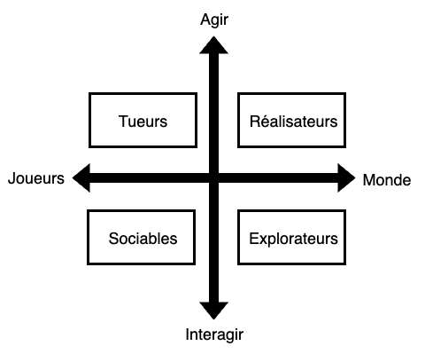

# Public cible

## Taxonomie des joueurs de Richard Bartle

### Axe horizontal : Joueurs ⟷ Monde

| Axe | **Gauche : Joueurs** | **Droite : Monde** |
| --- | --- | --- |
| Profil |  L’intérêt est centré sur les autres joueurs. Le joueur cherche l’affrontement, la coopération ou l’interaction sociale. | L’intérêt est centré sur le monde virtuel lui-même. Le joueur veut découvrir, construire, progresser ou maîtriser l’univers du jeu. | 

### Axe vertical : Agir ⟷ Interagir

| Axe | Profil |
| --- | --- | 
| **Haut : Agir** | Le joueur préfère agir sur son environnement ou sur les autres (imposer, conquérir, dominer, accomplir). C’est une posture active, orientée vers l’impact direct. Le joueur veut changer, transformer, contrôler |
| **Bas : Interagir** | Le joueur préfère interagir avec les autres ou le monde (dialoguer, échanger, explorer, comprendre). C’est une posture relationnelle, orientée vers l’échange ou la compréhension. Le joueur cherche à communiquer, collaborer, découvrir plutôt qu’imposer| 

### 4 grands profils

- Tueurs : agir sur les joueurs (compétition, PvP, domination) → attaquer, battre, dominer.
- Réalisateurs : agir sur le monde (avancer, accomplir, accumuler) → gagner des niveaux, accumuler des ressources, construire.
- Sociables : interagir avec les joueurs (coopération, amitié, communauté)  → discuter, créer des liens, coopérer .
- Explorateurs : interagir avec le monde (curiosité, découverte, compréhension) → explorer, observer, comprendre les mécaniques.

