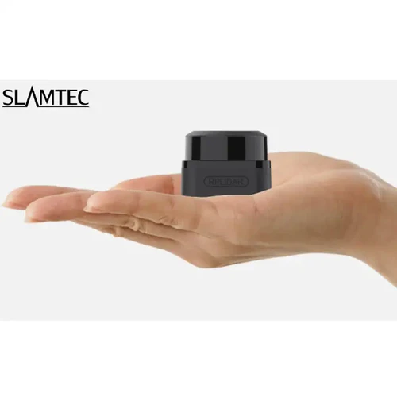

# OSCMO-LiDAR pour scanner laser LiDAR Slamtec

**OSCMO-LiDAR** (*Open Sound Control* Montmorency - LiDAR) assure la gestion et l'exploitation de données LiDAR, en particulier le [SLAMTEC C1 Scanner Laser DTOF 360°](https://ca.robotshop.com/fr/products/rp-lidar-360-tof-lidar), pour des environnements mobiles et interactifs en temps réel. 

Fonctionnalités du logiciel **OSCMO-LiDAR** :
- Transforme les mesures brutes de distance en regroupements interprétés comme des entités spatiales distinctes.
- Utilise le format Open Sound Control pour rendre les données accessibles à des logiciels tiers comme Max, Pure Data ou TouchDesigner.
- Est optimisé pour permettre son fonctionnement sur des architectures légères, telles que des microcontrôleurs ou des plateformes mobiles.

**OSCMO-LiDAR** peut être téléchargé ici : [OSCMO-LiDAR](https://codeberg.org/tim-montmorency/oscmo-lidar)  

