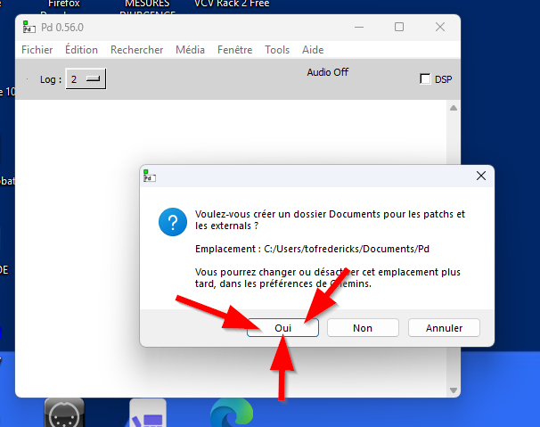

# Pure Data (Pd)

Pure Data (souvent abrégé **Pd**) est un environnement de programmation visuelle open-source développé par Miller Puckette (le créateur original de Max) au début des années 1990. 

Il permet de concevoir des logiciels interactifs srutout pour la musique, le traitement du son et les arts visuels en temps réel, le tout sans avoir à écrire de code textuel traditionnel. Le principe repose sur des **patchs** graphiques où l'on assemble des **objets** et des **boîtes** reliés par des cordons virtuels pour manipuler des flux de données (messages) ou des signaux audio (DSP).

Grâce à sa gratuité, sa grande légèreté et sa portabilité (il fonctionne sur macOS, Windows, Linux et même sur des ordinateurs embarqués comme le Raspberry Pi), Pd est largement utilisé par les musiciens, artistes numériques et chercheurs pour la création interactive et la performance en direct.

## Installation

L'installation de la version officielle de Pure Data (dite *vanilla*) s'effectue directement depuis  le site officiel de référence : [Software by Miller Puckette](https://msp.ucsd.edu/software.html) ou via [PureData.info](https://puredata.info/downloads/pure-data).

Sur certaines versions de déploiement (notamment en décompressant des archives binaires), l'exécutable principal, nommé simplement `pd` (ou `pd.exe`), se trouve directement à l'intérieur du dossier `bin`.

> [!WARNING]
> À l'ouverture de Pure Data, il se peut que le logiciel ouvre une boîte de dialogue vous demandant s'il doit créer le dossier **Documents > Pd**... répondre **oui!**

## Interface générale

L'interface de Pure Data repose sur des environnements de travail graphiques et modulaires où les éléments textuels et visuels interagissent entre eux pour traiter des flux de données et du son :

- **Patchs** : Un patch est le fichier de travail principal (enregistré avec l'extension `.pd`). C'est la feuille de canevas interactive sur laquelle on dispose et relie les différents composants de programmation.
- **Objets** : Représentés par des boîtes rectangulaires, ce sont les moteurs fonctionnels de Pure Data (ex. : oscillateurs, filtres, opérations mathématiques). Ils exécutent des actions ou du traitement de signal (DSP) en fonction de ce qui y est écrit à l'intérieur.
- **Messages** : Des boîtes interactives spécifiques qui contiennent du texte ou des instructions numériques. Lorsque l'on clique dessus, elles envoient immédiatement leur contenu sous forme de données pour piloter d'autres objets.
- **Commentaires** : Simples boîtes de texte libre non exécutables, indispensables pour documenter, structurer et annoter le fonctionnement d'un patch.
- **Éléments IU (Interface Utilisateur)** : Composants graphiques interactifs (boutons, curseurs, cadrans) permettant de manipuler des paramètres en temps direct ou d'en afficher l'état visuel.

## Modes d’édition et d’exécution

Le comportement de la souris et des boîtes change selon le mode actif dans Pure Data :

- **Edit Mode (Mode Édition)** : Indispensable pour concevoir et structurer le patch. Il permet de créer de nouveaux objets, de les déplacer, de modifier leur texte ou de tracer/effacer les cordons de câblage qui les relient.
- **Run Mode (Mode Exécution)** : Permet d'utiliser le patch de manière interactive. C'est dans ce mode que l'on clique sur les boutons (*bangs*), que l'on actionne les interrupteurs (*toggles*) et que l'on manipule les curseurs sans risquer de modifier accidentellement la structure du patch.

Raccourci de bascule : 

| Action | macOS | Windows / Linux |
| :--- | :--- | :--- |
| **Basculer édition / exécution** | ⌘ + E | Ctrl + E |

## Raccourcis pour les boîtes

Pour concevoir rapidement une interface et structurer un patch, Pure Data met à disposition plusieurs types de boîtes créables à l'aide de raccourcis clavier dédiés :

| Action / Élément | Raccourci (macOS) | Raccourci (Windows / Linux) | Description détaillée |
| :--- | :--- | :--- | :--- |
| **Créer un objet** | ⌘1 | Ctrl + 1 | Crée une boîte d'objet vide (`object`) pour insérer des fonctions, objets audio ou logiques. |
| **Créer un message** | ⌘2 | Ctrl + 2 | Crée une boîte de message (`message`) pour stocker et propager des instructions textuelles ou numériques. |
| **Créer un nombre** | ⌘3 | Ctrl + 3 | Crée un champ numérique (`floatatom` ou `number`) pour afficher ou modifier des valeurs décimales à la volée. |
| **Créer un symbole** | ⌘4 | Ctrl + 4 | Crée un champ textuel (`symbolatom`) pour manipuler des chaînes de caractères. |
| **Créer un commentaire** | ⌘5 | Ctrl + 5 | Crée un bloc de texte libre (`comment`) pour annoter le patch. |

## Connecter / Déconnecter

| Action | Procédure | Description détaillée |
| :--- | :--- | :--- |
| **Connecter** | Glisser depuis la sortie d'un objet vers l'entrée d'un autre | En mode édition, relie les ports de données ou de signal audio. |
| **Déconnecter** | Cliquer sur un câble → Touche Delete ou Backspace | En mode édition, sélectionne un câble existant pour le supprimer. |

## Éléments d’IU principaux 

| Élément IU | Méthode de création / Menu | Description détaillée |
| :--- | :--- | :--- |
| **Bang** | Menu *Put > Bang* | Bouton rond impulsionnel qui génère un signal déclencheur unique lorsqu'on clique dessus. |
| **Toggle** | Menu *Put > Toggle* | Interrupteur carré basculant alternativement entre les états 0 et 1 (marche/arrêt). |
| **Slider (Glissière)** | Menu *Put > H/V Slider* | Curseur horizontal ou vertical permettant de faire varier une valeur continue dans une plage définie. |
| **Radio (Boutons)** | Menu *Put > H/V Radio* | Groupe de boutons sélectifs mutuellement exclusifs pour choisir une option parmi plusieurs. |
| **Canvas** | Menu *Put > Canvas* | Zone graphique rectangulaire personnalisable servant de fond visuel ou de conteneur d'interface. |

## Raccourcis clavier généraux

| Action | macOS | Windows / Linux |
| :--- | :--- | :--- |
| **Basculer édition / exécution** | ⌘ + E | Ctrl + E |
| **Annuler (Undo)** | ⌘ + Z | Ctrl + Z |
| **Rétablir (Redo)** | ⌘ + Shift + Z | Ctrl + Y (ou Ctrl + Shift + Z) |
| **Copier / Coller** | ⌘ + C / ⌘ + V | Ctrl + C / Ctrl + V |
| **Dupliquer** | ⌘ + D | Ctrl + D |
| **Tout sélectionner** | ⌘ + A | Ctrl + A |
| **Sauvegarder** | ⌘ + S | Ctrl + S |
| **Zoom avant / arrière** | ⌘ + / ⌘ - | Ctrl + / Ctrl - |

## Activation de l'audio (DSP)

Contrairement à d'autres environnements où le moteur sonore est actif en continu, Pure Data nécessite d'activer manuellement le traitement du signal numérique (DSP) pour que les objets audio (générateurs, filtres, entrées/sorties de carte son) émettent ou traitent du son.

- **Procédure** : Allez dans le menu supérieur **Media** et sélectionnez **DSP On** (ou utilisez le raccourci global **⌘ + /** sur macOS / **Ctrl + /** sur Windows/Linux, ou encore en cliquant directement sur l'indicateur textuel "DSP" situé en bas de la fenêtre principale ou du patch).
- **Indicateur** : Lorsque le DSP est actif, l'état s'affiche clairement, et le processeur commence à calculer les flux audio en temps réel. Pensez à le désactiver (*DSP Off*) lorsque vous modifiez de lourds routages pour éviter les saturations ou les pics de charge CPU.

## La fonction d'aide (Help)

Pure Data intègre un système d'aide contextuelle extrêmement puissant et interactif, basé entièrement sur des patchs d'exemple exécutables. Faites un **clic droit** sur n'importe quel objet existant dans un patch, puis choisissez l'option **Help** dans le menu contextuel. Cela ouvre immédiatement un patch `.pd`. Ce patch d'aide contient des descriptions textuelles, mais surtout des exemples pratiques câblés que l'on peut manipuler, modifier, tester et même copier-coller directement dans ses propres créations.