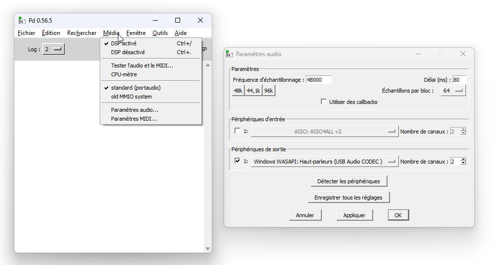

# Pd : Activation de l'audio

Pure Data nécessite d'activer manuellement le traitement du signal numérique (DSP) pour que les objets audio (générateurs, filtres, entrées/sorties de carte son) émettent ou traitent du son.

- Allez dans le menu **Media** et sélectionnez **Paramètres audio**.
    - Si aucune entrée audio est nécessaire, décochez la.
    - Configurez le périphérique de sortie.
    - Appliquez les changements.
- Allez dans le menu **Media** et sélectionnez **DSP On**.

