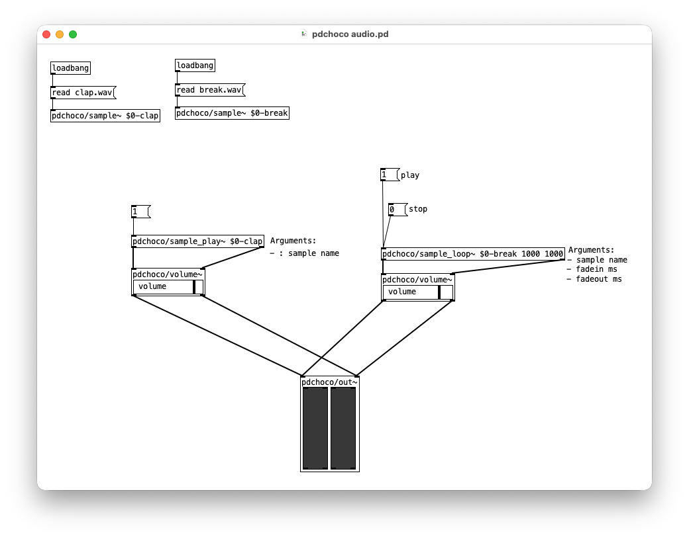

# Pd : Lecture de fichiers audio avec Pdchoco

Ce patch Pure Data fonctionne comme un mini-lecteur et mixeur d'échantillons sonores. Il utilise [pdchoco](../../pdchoco/).

## Isolation et gestion des références avec `$0`

Pour éviter les conflits lorsque plusieurs fenêtres ou patchs similaires sont ouverts en même temps, on utilise la variable `$0`. Cela attribue un numéro unique à chaque instance du patch. Dans ce système, les abstractions de stockage `pdchoco/sample~` et les objets de lecture (`pdchoco/sample_play~` et `pdchoco/sample_loop~`) communiquent via des identifiants uniques distincts (comme `$0-clap` et `$0-break`). Ainsi, chaque copie du patch gère sa propre mémoire audio de manière totalement indépendante sans écraser les données des autres patchs ouverts.

## Initialisation et chargement des sons

Dès l'ouverture du fichier, des objets `loadbang` déclenchent indépendamment le chargement des fichiers audio dans leurs abstractions de stockage respectives grâce à la commande `read` : le fichier `clap.wav` est chargé dans l'espace `$0-clap`, et le fichier `break.wav` est chargé dans l'espace `$0-break`.

## Lecture simple et en boucle

Le patch propose deux comportements distincts basés sur des abstractions dédiées :
* **La lecture simple :** Un déclencheur active l'abstraction `pdchoco/sample_play~ $0-clap`, qui lit ponctuellement le son de claquement de mains. Le signal traverse ensuite l'abstraction de contrôle `pdchoco/volume~` pour ajuster son niveau.
* **La lecture en boucle :** Des commandes d'activation et d'arrêt pilotent l'abstraction `pdchoco/sample_loop~ $0-break 1000 1000`, qui répète continuellement le rythme de batterie avec des temps de fondu d'une seconde (1000 ms). Son niveau est également géré par sa propre abstraction `pdchoco/volume~`.

## Mixage et sortie audio

L'abstraction finale `pdchoco/out~` centralise et mixe les flux provenant des deux pistes de volume pour acheminer le signal audio final vers la carte son.