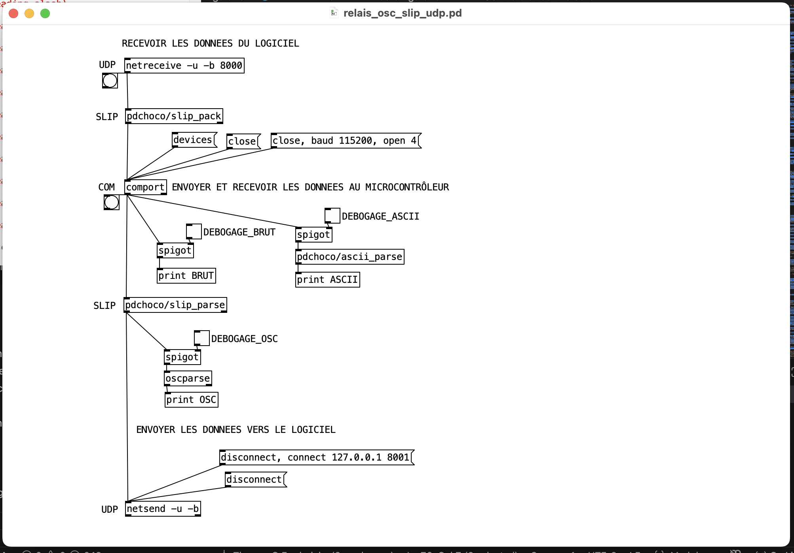

# Pd : Relais OSC SLIP ⇄ UDP

## Prérequis

- Installation de comport dans Pd.
- Installation de [pdchoco](../../pdchoco/).

## Patcher Pure Data pour le relais des messages OSC SLIP vers UDP (unidirectionnel)

Télécharger le patcher ici : [relais_osc_slip_vers_udp.pd)](./relais_osc_slip_vers_udp.pd)

## Patcher Pure Data pour le relais des messages OSC SLIP vers UDP bidirectionnel

Télécharger le patcher ici : [relais_osc_slip_udp_bidirectionnel.pd](./relais_osc_slip_udp_bidirectionnel.pd)

