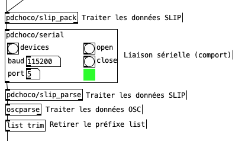
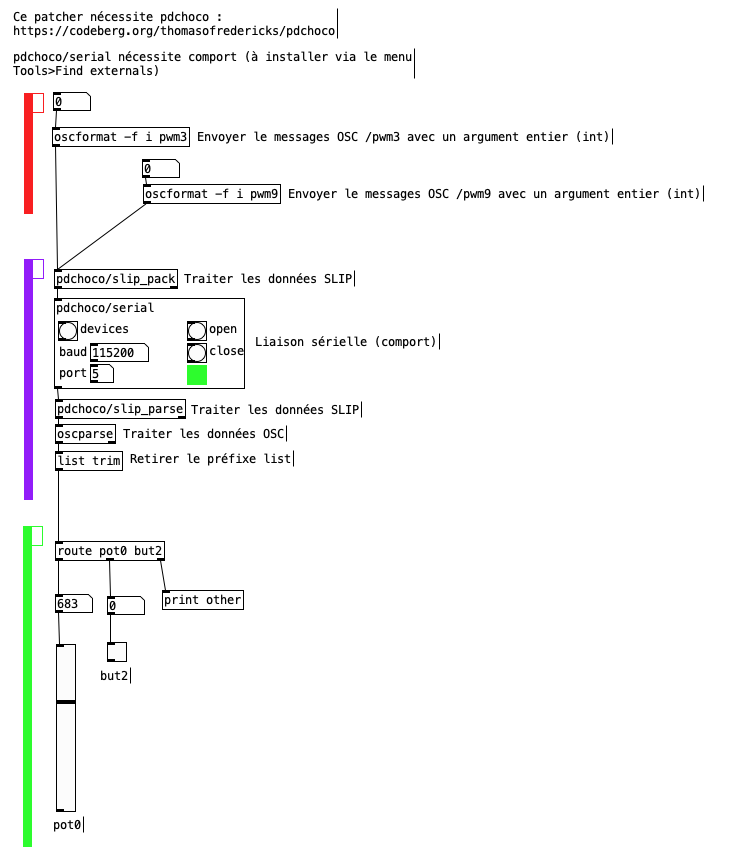

#  OSC SLIP dans Pd

Pour l'OSC SLIP dans Pd, il faut installer :
* `comport`
* `pdchoco`

## Installation des objets additionnels pour l'OSC SLIP dans Pure Data

### 1. Objet `comport`

Suivre les instructions pour l'installation de `comport` : [communication sérielle dans Pd](../../serial/)

### 2. Bibliothèque `pdchoco`

Suivre les instructions pour l'installation de `pdchoco` : [pdchoco](../../pdchoco/)

## Bloc de base

Liaison sérielle :

* `pdchoco/serial` : cet objet assure la communication bidirectionnelle via la liaison sérielle.

Envoi de SLIP :

* `pdchoco/slip_pack` : cet objet convertit les listes de nombres en SLIP.
* La conversion des messages OSC en liste de nombres n’est pas visible sur l’image.

Réception d'OSC SLIP :

* `pdchoco/slip_parse` : cet objet convertit les données SLIP en liste de nombres.
* `oscparse` : cet objet convertit la liste de nombres en message OSC.
* `list trim` : cet objet supprime le sélecteur `list` afin que les données soient directement utilisables par les objets suivants.

## Exemple pour la réception de messages OSC SLIP 

Télécharger le patcher [slip_osc.pd](./slip_osc.pd).