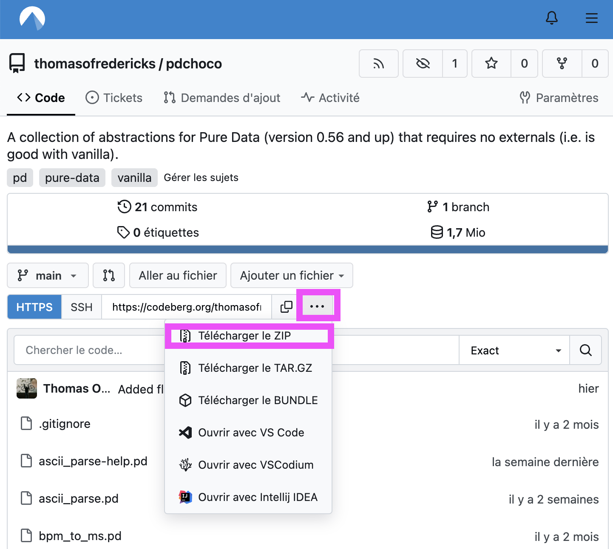
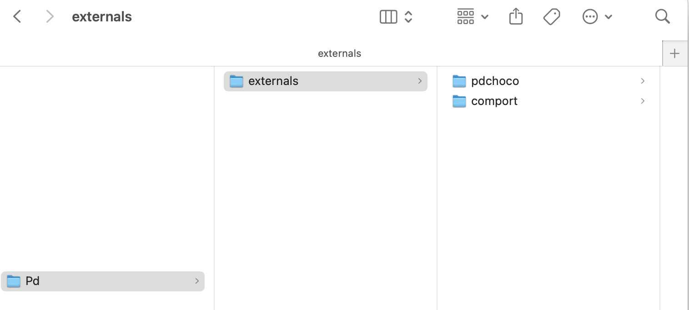

# pdchoco

## Installation

### Télécharger

Télécharger à partir de [thomasofredericks/pdchoco sur Codeberg.org](https://codeberg.org/thomasofredericks/pdchoco)

### Déplacer

Déplacez le dossier **pdchoco** ( pas *pdchoco-main* ) dans **Documents > Pd > externals**. Si ce dossier n'existe pas, partez Pure Data une fois avant.

