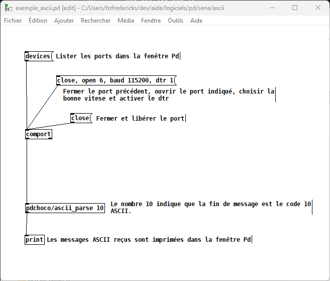

# Pd : ASCII sérielle

Pour recevoir des messages ASCII du port série, appelé `comport` dans Pd, nous devons utiliser `pdchoco/ascii_parse` de la bibliothèque `pdchoco`.

Télécharger le patcher ici : [exemple_ascii.pd](./exemple_ascii.pd)