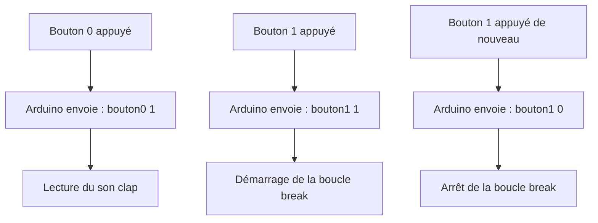
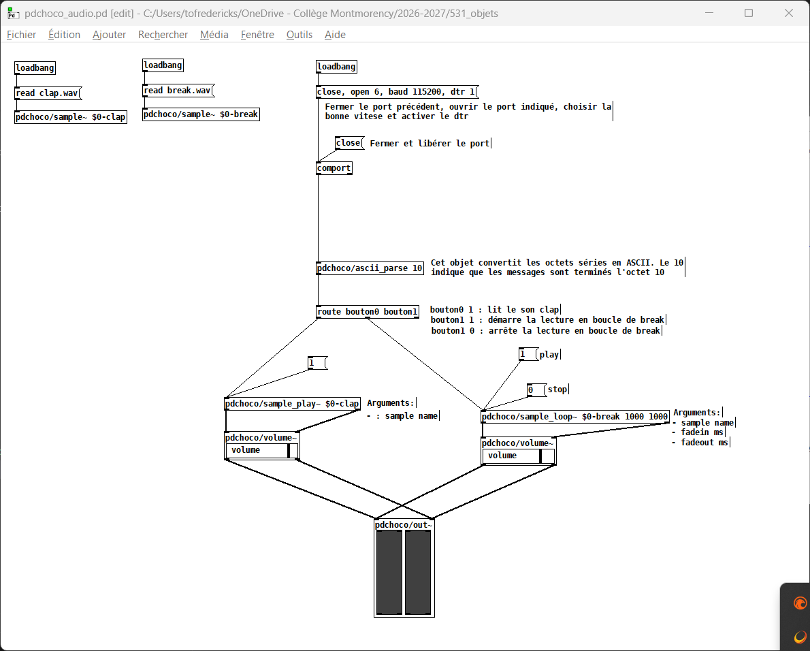

# Tutoriel : Arduino, Pd, ASCII et audio

Dans cet exemple, l'Arduino agit comme une interface entre des boutons physiques et le moteur audio de Pure Data. Chaque interaction avec un bouton est convertie en un message texte (ASCII) envoyé par le port série. Pure Data reçoit ensuite ces messages et exécute l'action sonore correspondante. 



## Envoi d'Arduino

L'Arduino détecte les appuis sur les boutons et envoie des messages texte (ASCII) à Pure Data via le port série USB. Pure Data reçoit ces messages, les interprète et déclenche les sons correspondants.

Lorsqu'un bouton est actionné, Arduino envoie un message sous la forme :

```text
bouton0 1
```

ou

```text
bouton1 1
```

ou

```text
bouton1 0
```

où :

- `bouton0 1` déclenche la lecture du son *clap* ;
- `bouton1 1` démarre la lecture en boucle du son *break* ;
- `bouton1 0` arrête la lecture en boucle du son *break*.

Le caractère de fin de ligne ajouté par `Serial.println()` permet à Pure Data de savoir où se termine chaque message.

Le bouton 1 utilise une variable booléenne (`lectureBoucle`) pour mémoriser l'état de la boucle. À chaque nouvel appui, la variable change d'état :

```text
false → true  → envoi de "bouton1 1"
true  → false → envoi de "bouton1 0"
```


Code Arduino :

```cpp
#include <Arduino.h>
#include <Bounce2.h>

Bounce2::Button bouton0;
Bounce2::Button bouton1;

bool lectureBoucle = false;

void setup()
{
    Serial.begin(115200);

    bouton0.attach(2, INPUT_PULLUP);
    bouton0.setPressedState(LOW);

    bouton1.attach(3, INPUT_PULLUP);
    bouton1.setPressedState(LOW);
}

void loop()
{
    bouton0.update();

    if (bouton0.pressed()) {
        Serial.print("bouton0");
        Serial.print(" ");
        Serial.print(1);
        Serial.println();
    }

    bouton1.update();

    if (bouton1.pressed()) {

        if (lectureBoucle == true) {
            lectureBoucle = false;
        } else {
            lectureBoucle = true;
        }

        Serial.print("bouton1");
        Serial.print(" ");
        Serial.print(lectureBoucle);
        Serial.println();
    }
}
```

### Réception dans Pure Data

- L'objet `comport` ouvre le port série et reçoit les octets envoyés par Arduino.
- `pdchoco/ascii_parse` convertit les données reçues en messages Pd. Le nombre `10` correspond au caractère de fin de ligne (`\n`) envoyé par `Serial.println()`.
- L'objet `route bouton0 bouton1` sépare les messages selon leur nom :
  - `bouton0` est envoyé vers la première sortie ;
  - `bouton1` est envoyé vers la deuxième sortie.

Dans ce patch :

- la réception de `bouton0 1` déclenche la lecture du son **clap** ;
- la réception de `bouton1 1` démarre la boucle **break** ;
- la réception de `bouton1 0` arrête la boucle **break**.

Patch Pure Data : [arduino_pd_ascii_audio.pd](arduino_pd_ascii_audio.pd)

