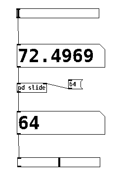
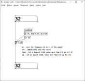

# Effectuer un glissement entre des valeurs avec Pd

## Patch pour effectuer un glissement

Ce patch de permet d'effectuer un glissement sur un flux de valeur. Il permet de rendre plus continu et de réduire les aspérités. Un facteur de glissement différent peut être configuré si le flux de valeur augmente ou s'il baisse.

Télécharger ici : [slide.pd](./slide.pd)

### Configuration du glissement

