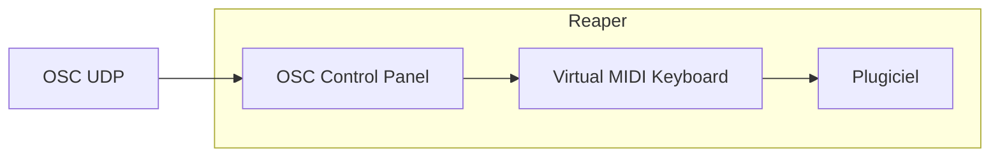
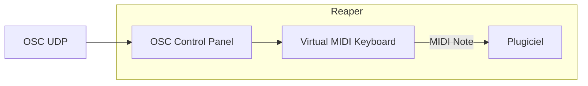
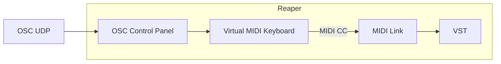

# Reaper : contrôle d'un plugiciel par OSC

## Préalable(s)

- [Activation de l'OSC dans Reaper](../../osc/activation/)
- Utilisation du [Virtual MIDI Keyboard](../../virtual_midi_keyboard/)
- Configuration [MIDI d'un plugiciel](../midi/)

### Pour contrôler un plugiciel par OSC, il faut passer par le Virtual MIDI Keyboard




#### Message OSC pour envoyer un MIDI Note au Virtual MIDI Keyboard



Si le [défaut](../../osc/defaut/) est utilisé, voici le format du message OSC :
```
/vkb_midi/@/note/# i
```
* `@` : canal 0-15 (int)
* `#` : numéro de la note 0-127 (int)
* `i` : vélocité 0-127 (int)

#### Message OSC pour envoyer un MIDI CC au Virtual MIDI Keyboard




Si le [défaut](../../osc/defaut/) est utiliséest utilisé, voici le format du message OSC :
```
/vkb_midi/@/cc/# i
```
* `@` : canal 0-15 (int)
* `#` : numéro du CC 0-127 (int)
* `i` : valeur 0-127 (int)


