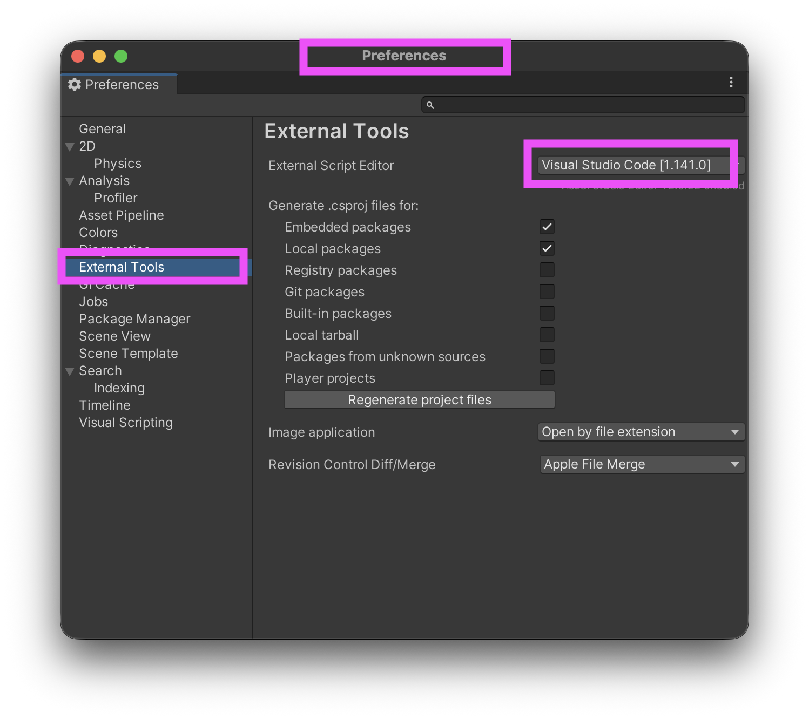
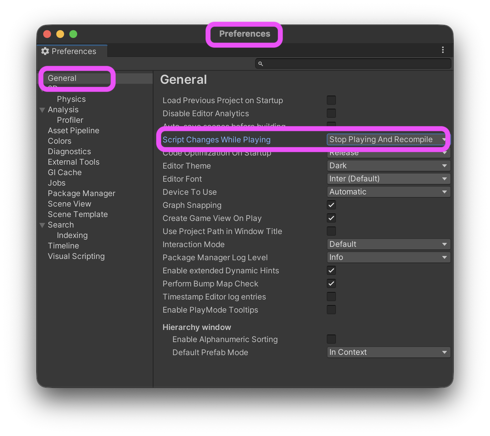

# Unity : configuration

Voici les modifications suggérées à la configuration de Unity :

- [Unity : Bonnes pratiques Git](../git/)
- [Unity : Exécution en arrière-plan](../execution_arriere-plan/)
- Sélection de l’éditeur *Visual Studio Code* dans les **préférences** (ne pas confondre avec *Project Settings...*) :

- Arrêt du jeu lors de la compilation :
