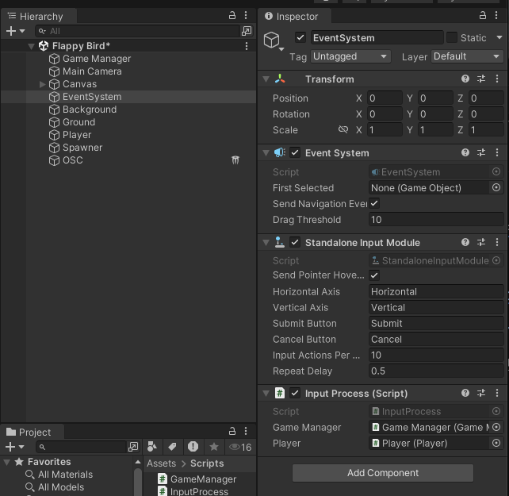
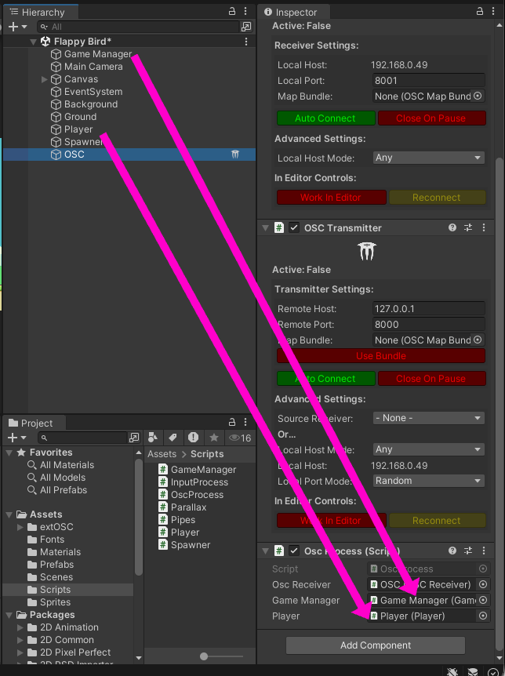
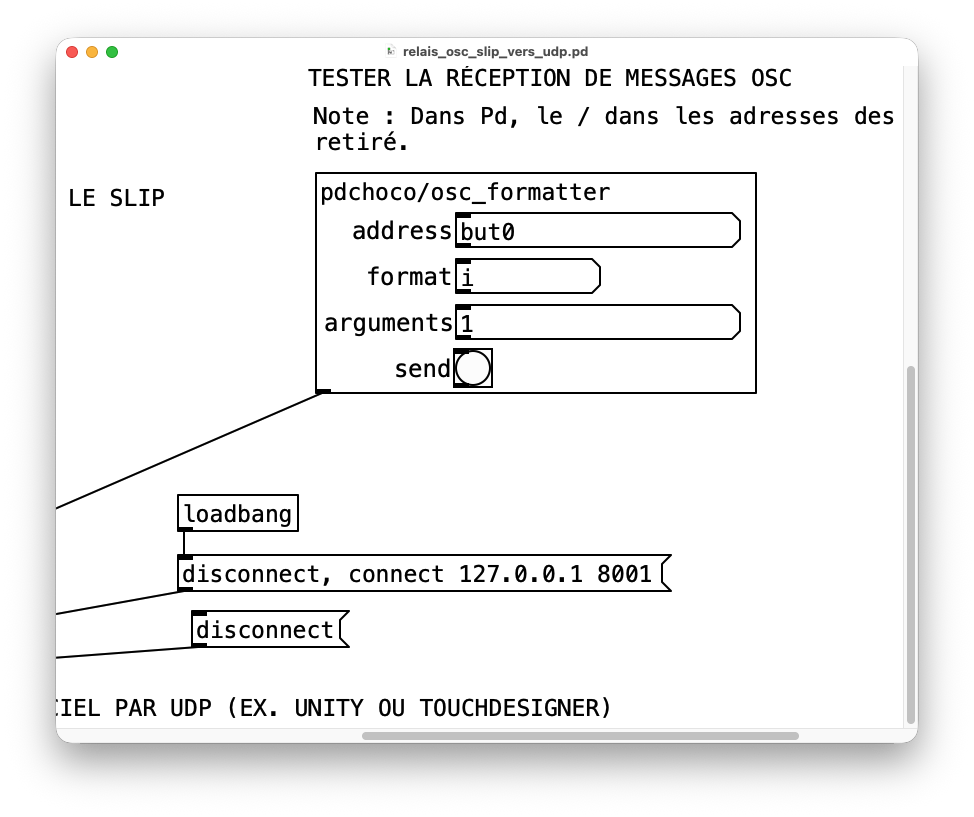
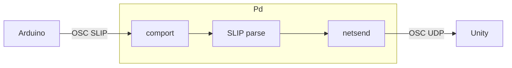
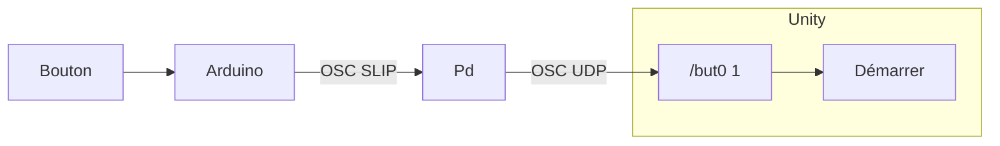
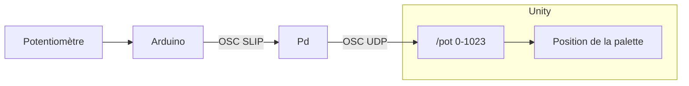

# Unity : OSC UDP avec extOSC

<!-- toc -->

Intégration de l’OSC UDP dans Unity avec **extOSC**.

## Initialisation d’extOSC dans Unity 

### Préalables

- [Activer l’exécution en arrière-plan](../../execution_arriere-plan/)

### Installation de extOSC

Recherchez « extOSC » dans l’[Asset Store](https://assetstore.unity.com/) (assurez-vous d’être connecté à votre compte Unity avant) :  


Cliquez sur le bouton pour ajouter « extOSC » à vos *assets*, puis cliquez de nouveau pour ouvrir l’*asset* dans Unity :  


Téléchargez le paquet « extOSC » à partir du gestionnaire de paquets :  


Cliquez sur le bouton pour importer le paquet « extOSC » :  


Installez toutes les dépendances :  


Importez tous les *assets* :  


Vous devriez maintenant voir *extOSC* dans vos *assets* :  


## Initialisation de l’objet de contrôle OSC

> [!Note]
> Effectuez les étapes suivantes une seule fois par scène.

* Créez un nouveau *GameObject* vide nommé `OSC`.
* Ajoutez-y les scripts (inclus avec *extOSC*) `OSCTransmitter` et `OSCReceiver`.
* Configurez ces deux scripts avec les paramètres réseau appropriés.


### Script de gestion de l’OSC (à faire UNE SEULE FOIS)

Créer un script nommé `OscProcess`. Effectuer les étapes suivantes dans ce script.

#### Importer le namespace extOSC
Au début du script immédiatement après les autres `using` :
```csharp
using extOSC;
```

#### Déclarer la variable du récepteur OSC
Dans la classe `OscProcess` et avant les méthodes, déclarer une référence au `OSCReceiver` :
```csharp
public extOSC.OSCReceiver oscReceiver;
```

#### De retour dans l’éditeur Unity lier les propriétés

- Glisser le script `OscProcess` sur le GameObject `OSC`.
- Dans l’Inspecteur, glisser-déposer le GameObject  `OSC` sur la variable publique `oscReceiver` du script.


### Configuration par adresse OSC (à répéter pour chaque adresse)

> [!IMPORTANT] 
> Pour chaque adresse OSC différente (`/but0`, `/but1`, `/angle`, `/lumiere`, etc.), vous devez créer **une fonction dédiée** et **un Bind() séparé**.


#### Lier l’adresse OSC à une fonction dans Start()

Retourner dans le script `OscProcess`.

Dans la méthode `Start()`, associez chaque adresse OSC à sa fonction via `Bind()`. Par exemple, ici nous indiquons que lors que le message `"/but0"` est reçu, nous déclenchons la méthode `TraiterMessageBut0` (que nous définissons par après) :
```csharp
oscReceiver.Bind("/but0", TraiterMessageBut0);
```

> [!WARNING]
> Créez un `oscReceiver.Bind()` et une fonction de traitement différente pour **CHAQUE** adresse OSC à traiter.

#### Créer une fonction de traitement dédiée
Chaque adresse nécessite sa propre fonction avec un nom explicite. Ici nous ajoutons la méthode `TraiterMessageBut0` dans la classe `OscProcess` (à la fin) :
```csharp
void TraiterMessageBut0(OSCMessage message)
{
    // Validez qu’il y a bien le nombre attendu d’arguments (1 dans l’exemple) :
    if (message.Values.Count != 1)
    {
        Debug.Log("Le message " + message.Address  + " n’a pas le bon nombre d’arguments");
        return; // Quitte la fonction sans exécuter la suite
    }

    // Vérifiez que l’argument est du type attendu (`int` dans l’exemple) :
    if (message.Values[0].Type != OSCValueType.Int)
    {
        Debug.Log("Le premier argument du message " + message.Address  + "n’est pas un entier");
        return; // Quitte la fonction sans exécuter la suite
    }

    // Récupérer la valeur de l’argument :
    int valeur = message.Values[0].IntValue;

    // Deboguer
    // Debug.Log("Reçu : " + message.Address + " " + valeur);

    // TRAITER LA VALEUR ICI !


}

```

###  Tableau récapitulatif

| Étape | Configuration |
|----|-----------|
| Importer `using extOSC;` | 1️⃣ Une seule fois |
| Créer un script de gestion de l’OSC  ()`OscProcess`) | 1️⃣ Une seule fois |
| Déclarer `oscReceiver` | 1️⃣ Une seule fois |
| Relier le GameObject `OSC` dans l’inspecteur | 1️⃣ Une seule fois |
| Créer une fonction de traitement (`TraiterMessage...`) | ♻️ Pour chaque adresse |
| Ajouter `oscReceiver.Bind()` dans `Start()` | ♻️ Pour chaque adresse |

## Exemple Flappy Bird Unity, Pd et Arduino Nano avec bouton d’arcade par OSC

Quand on appuie sur un bouton d’Arcade, cela envoie le message OSC SLIP `/but0 1` à Pd qui le relaye par UDP à Unity.


### Préalables

- Suivre les instructions pour l’exemple du bouton d’Arcade au bas de la page [MicroOsc SLIP](/fabrication/arduino/microosc/slip/).
- Fourcer (*forker*) le dépôt [thomasfredericks/unity-flappybird](https://github.com/thomasfredericks/unity-flappybird).
- Suivre les instructions pour l’intégration d’extOSC plus haut.

### Investiguer le code Unity

Identifier le code Unity pour trouver le bloc de code ou la méthode qui :
- Démarre le jeu.
- Bat les ailes du personnage.

Dans le script `InputProcess` on retrouve les lignes suivantes :
```csharp
    public GameManager gameManager;
    public Player player;
```

Ainsi que celles-ci :
```csharp
    void Update()
    {
        if ( (Input.GetKeyDown(KeyCode.Space) || Input.GetMouseButtonDown(0)))
        {
            gameManager.StartGame(); // Ignored if game is already playing, handled in GameManager
            player.Jump();}
    }
```



### Modifier le code Unity

Il faut ajouter les propriétés suivantes dans la classe de notre script `OscProcess` :
```csharp
    public GameManager gameManager;
    public Player player;
```

Nous modifions aussi notre méthode `TraiterMesageBut0` du script `OscProcess` :
```csharp
    // TRAITER LA VALEUR ICI !
    if (valeur == 1)
    {
        gameManager.StartGame(); // Ignored if game is already playing, handled in GameManager
        player.Jump();
    } else {

    }
```



> [!NOTE]
> Appuyer sur Play pour partir le projet Unity!

### Le patcher Pd

Le patcher Pd `relais_osc_slip_vers_udp.pd` permet :
- D’envoyer des messages OSC UDP à Unity.
- De relayer les messages OSC SLIP reçus par `comport` en OSC UDP à Unity.


Télécharger le patcher ici : [relais_osc_slip_vers_udp.pd](./relais_osc_slip_vers_udp.pd)

> [!WARNING]
> Dans le patcher `relais_osc_slip_vers_udp.pd`, il faut s’assurer que le port UDP est le même que celui du `OSC Receiver` du GameObject `OSC` dans Unity. Il est de 8001 dans l’image plus bas, mais est-ce que c’est le bon ?

Il est possible de tester la réception de l’OSC dans Unity à l’aide de `pdchoco/osc_formatter`. Y entrer les informations suivantes et appuyer sur `send` :
- **address** : `but0` (ce qui correspond en OSC à /but0)
- **format** : `i` (un entier)
- **arguments** : `1`




> [!NOTE]
> Terminer de configurer `comport` et appuyer sur le bouton d’arcade ; Flappy devrait battre des ailes !

Les messages OSC SLIP sont envoyés à Pure Data qui les relaye à Unity en OSC UDP.



## Tutoriel Pong : Unity, Pd, OSC et Arduino Nano avec bouton d’arcade et potentiomètre

Dans ce tutoriel, nous voulons contrôler le jeu [thomasfredericks/unity-pong](https://github.com/thomasfredericks/unity-pong) avec un bouton pour le lancer de la balle et un [potentiomètre](/fabrication/electronique/composants/potentiometre/) pour la position de la palette.   

### Comportement désiré du bouton

- Quand on appuie sur un bouton d’Arcade :
    - Arduino envoie le message OSC SLIP `/but0 1` à Pd.
    - Pd le relaye par UDP à Unity.
    - Unity lance la balle de Pong.



> [!IMPORTANT]
> Nous traitons le bouton comme un **événement discret**.
> Le message n’est envoyé que lors de l’appui ou du relâchement.
> Si le bouton est maintenu, rien de nouveau n’est envoyé.
> Sa valeur est booléenne : `0` ou `1`.

### Comportement désiré du potentiomètre


- Quand on tourne le potentiomètre :
    - Arduino envoie le message OSC SLIP `/pot` suivi d’un argument entre `0` et `1023` à Pd.
    - Pd le relaye par UDP à Unity.
    - Unity contrôle la palette du joueur.





> [!IMPORTANT]
> Nous traitons le potentiomètre comme un **flux continu**.
> La valeur est lue continuellement et envoyée de façon régulière à Unity.
> Sa valeur se situe dans une plage de valeurs (typiquement entre `0` et `1023` inclusivement).

### Récapitulatif

| Captation | Type | Fréquence | Plage |
| --- | --- | --- | --- |
| Bouton avec `pressed()` ou `released()` | Évènement discret | Une fois quand l’état du bouton change | `0` ou `1` |
| Potentiomètre avec `analogRead()` | Flux continu | Envoyé de façon continue à chaque 20 millisecondes | Entre `0` et `1023` inclusivement |


### Préalables Arduino

Nous partons du même code et du même circuit que le tutoriel précédent ci-haut.

- Brancher le bouton tel que montré dans l’exemple du bouton d’Arcade au bas de la page [MicroOsc SLIP](/fabrication/arduino/microosc/slip/) 
- Copier le code de l’exemple du bouton d’Arcade au bas de la page [MicroOsc SLIP](/fabrication/arduino/microosc/slip/) 

#### Modifications au circuit et au code Arduino

Ajouter un [potentiomètre](/fabrication/electronique/composants/potentiometre/) au circuit (le bouton d’Arcade n’est pas dans l’image).
*   Broche centrale du potentiomètre -> Pin A2 (ou analogique libre) sur l'Arduino.
*   Les deux autres broches -> 5V et GND.


Pour générer un flux continu, nous allons utiliser la bibliothèque [Chrono](/fabrication/arduino/chrono/) pour lire la valeur du potentiomètre à intervalles réguliers.

Après avoir ajouté Chrono à votre projet, créer un chronomètre pour le flux de données dans l’espace global :
```cpp
Chrono chronoPot;
```

Dans `loop()`, ajouter le code suivant pour envoyer la valeur du potentiomètre à chaque 20 millisecondes :
```cpp
if ( chronoPot.hasPassed(20)) { // SI LE CHRONO DÉPASSE 20 MILLISECONDES
    chronoPot.restart(); // REPARTIR LE CHRONO

    int valeur = analogRead(2); // LECTURE DE LA TENSION ENTRE 0 ET 1023

    monOsc.sendInt("/pot", valeur); // ENVOYER LA VALEUR
}
```

> [!NOTE]
> Téléverser le code sur l’Arduino.
> Cela crée un flux d'environ ~50 messages par seconde (un message par 20 millisecondes) vers Pure Data.

### Pure Data

Ouvrir le patcher [relais_osc_slip_vers_udp.pd](./relais_osc_slip_vers_udp.pd) et configurer [comport](/logiciels/pd/serie/comport).

### Préalables Unity

- Fourcher (*forker*) le dépôt [thomasfredericks/unity-pong](https://github.com/thomasfredericks/unity-pong).
- Jouer au jeu.
- Suivre les instructions pour l’intégration d’extOSC en haut de cette page.

> [!NOTE]
> Il faut s’assurer que les # de ports OSC dans Pd et dans Unity sont les mêmes.

### Modifications au code Unity

#### Le bouton

Cette étape est assez simple, elle est très similaire au tutoriel précédent.

- Trouver dans le code Unity la fonction utilisée pour lancer la balle. Astuce : regarder dans le script attaché au GameObjet `Game Manager`.
- Ajouter à `OscProcess` les variables publiques nécessaire pour parler au script de lancer de la balle.
- Effectuer un `Bind` dans `OscProcess` entre le message `/but0` et une nouvelle fonction de traitement de message (vous référer au tutoriel précédent).
- Dans cette fonction, lorsqu’un `1` est reçu, appeler la fonction qui lance la balle (vous référer au tutoriel précédent).

Extrait de la fonction de traitement du message `/but0` :
```csharp
    // TRAITER LA VALEUR ICI !
    if (valeur == 1)
    {
        // METTRE ICI L'APPEL À LA FONCTION POUR LANCER LA BALLE
        // COMME INDICE, C'EST QQCH COMME : gameState.Throw()
    } else {

    }
```

#### Le potentiomètre

La lecture du potentiomètre donne des valeurs entre 0 et 1023. Nous devons ajuster la plage de ces valeurs pour qu’elles correspondent aux coordonnées de position verticale de la palette.

- Trouver dans le code Unity la fonction qui permet de déplacer la palette. Astuce : regarder dans les scripts attachés au GameObjet `Player`.
- Ajouter  à `OscProcess` les variables publiques nécessaires pour référer à la palette.
- Effectuer un `Bind` dans `OscProcess` entre le message `/pot` et une nouvelle fonction de traitement de message.
- Dans cette fonction, nous n'utilisons **pas** le code à fonctionnement booléen précédent :
```csharp
    // TRAITER LA VALEUR ICI !
    // if (valeur == 1)
    // {
    // } else {
    // }
``` 
- Nous allons plutôt utiliser le code suivant pour une plage de valeurs, qui transforme le flux brut d'une plage entre 0 et 1023 en coordonnées de jeu fluides (par exemple : -1.0 à 1.0). :
```csharp
    // TRAITER LA VALEUR ICI !
    float ajuste = ((valeur - potInMin) / (potInMax - potInMin) * (potOutMax - potOutMax) + potOutMax);
    // AJOUTER À LA LIGNE SUIVANTE LE CODE POUR APPLIQUER LA VARIABLE ajuste AU DÉPLACEMENT DE LA PALETTE ICI !
    // COMME INDICE C'EST QQCH COMME : palette.setVercialPosition( ajuste);
```

- Nous devons aussi ajouter les variables (propriétés) suivantes en haut de la **classe** `OscProcess` pour qu'elles puissent être ajustées :
```csharp
public int potInMin = 0;
public int potInMax = 1023;
public float potOutMin = 0.0f;
public float potOutMax = 1.0f;
```


- De retour dans l’éditeur Unity, **lancer le jeu**.
- La palette devrait bouger en fonction de la rotation du potentiomètre, mais ne couvre pas tout le terrain.
- Il faut ajuster les valeurs des variables `potOutMax` et `potOutMin` du script `OscProcess` que vous venez de créer pour que le minimum et le maximum de rotation du potentiomètre corresponde à la coordonnée de position verticale au minimum et maximum de hauteur du terrain.
    - Ajuster manuellement les valeurs `potOutMin` et `potOutMax` dans l'Inspecteur Unity (sans toucher au code).


<!--
### Tester avec des messages OSC

Tester en envoyant à Unity un messages OSC de type entier avec une valeur 0 ou 1 tel que :
- `but0 0`
- `but0 1`


## Fonction utilitaire ChangerPlageDeValeurs()

Si les données reçues ne sont pas limitées entre les valeurs 0 et 1, il faut souvent ajuster la plage des valeurs. Supposons la lecture analogique d’un potentiomètre 12 bits (valeurs 0 à 4095) pour contrôler la rotation d’un objet dans Unity. La fonction suivante effectue une reconversion linéaire de plage de valeurs (aussi appelée mapping ou remapping). Elle transforme proportionnellement une valeur d’une plage d’entrée vers une plage de sortie différente.

Ajouter cette méthode dans la classe `OscProcess` :
```csharp
public static float ChangerPlageDeValeurs(float value, float inputMin, float inputMax, float outputMin, float outputMax)
{
    return Mathf.Clamp(((value - inputMin) / (inputMax - inputMin) * (outputMax - outputMin) + outputMin), outputMin, outputMax);
}
```

### Lors de la réception des valeurs dans TraiterMessage...

Appliquez vos transformations et actions sur l’objet :
```csharp
// Récupérer la valeur de l’argument :
int valeur = message.Values[0].IntValue;

// Exemple : adapter proportionnellement la valeur reçue
float angle = ChangerPlageDeValeurs(valeur, 0, 4095, -180, 180);

// Exemple : appliquer une rotation à un objet ciblé
tagetGameObjet.transform.rotation = Quaternion.Euler(0, angle, 0);
```

->