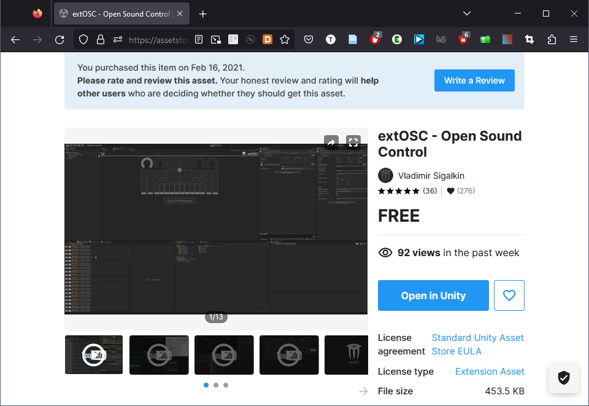
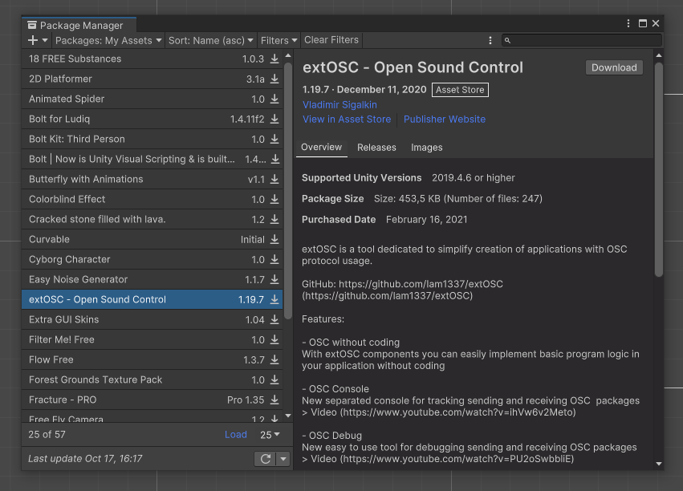
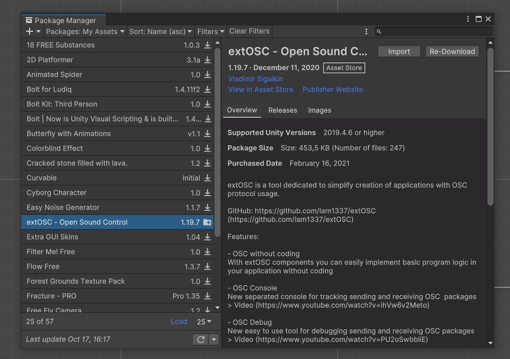
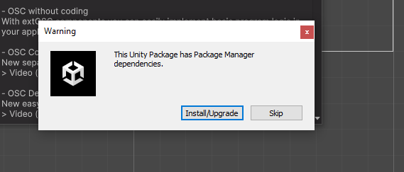
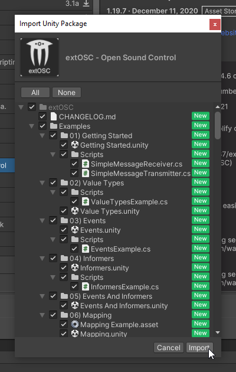
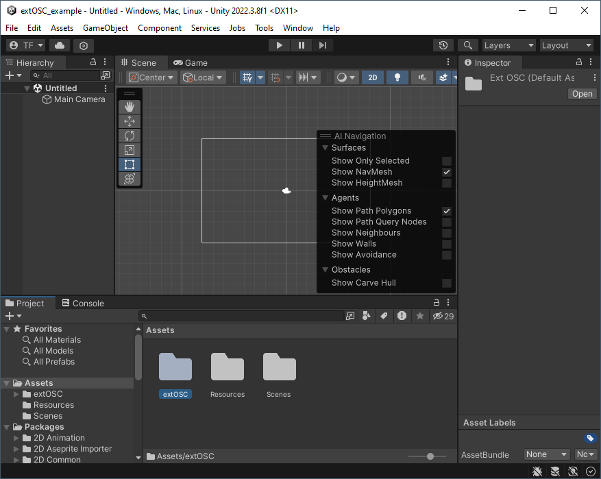
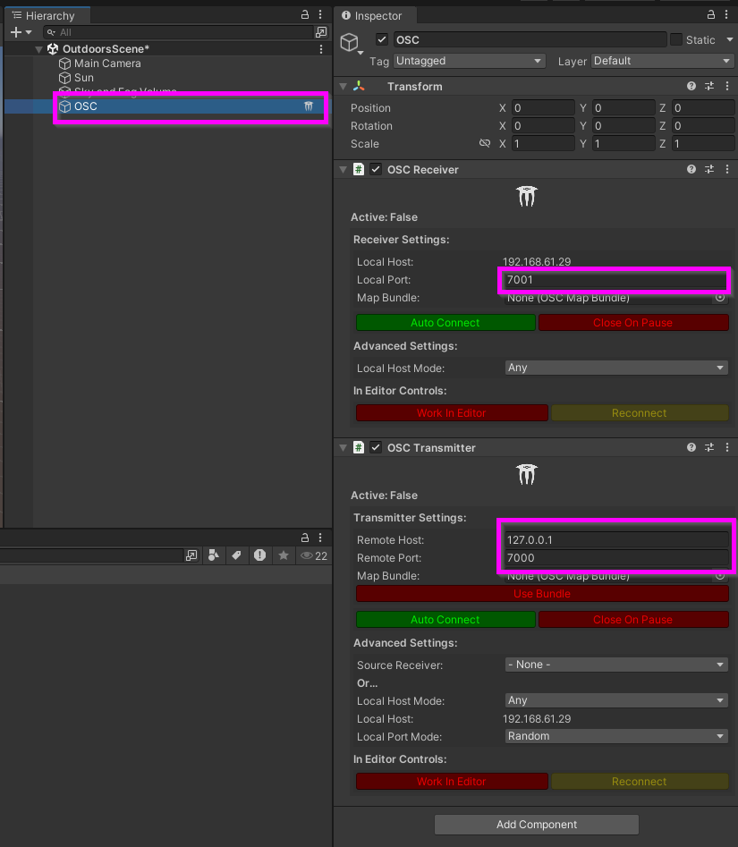
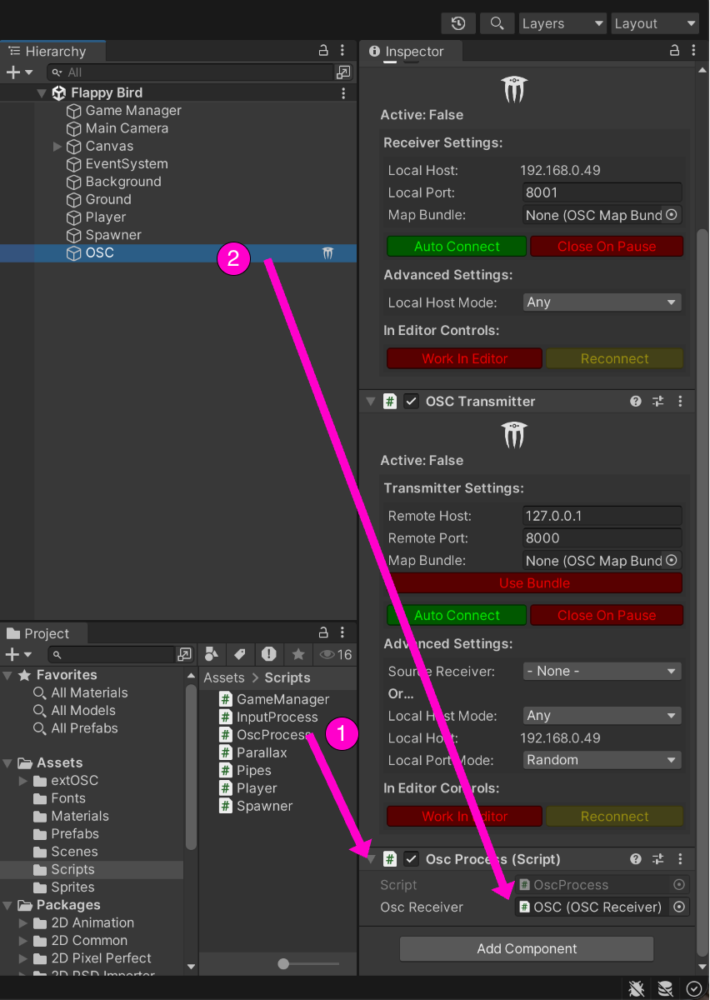

# Unity : OSC UDP avec extOSC

<!-- toc -->

Ces instructions présentent l’intégration de l’OSC UDP dans Unity avec **extOSC**.

## Activer l’exécution en arrière-plan

Avant tout, il faut [activer l’exécution en arrière-plan](../../execution_arriere-plan/) pour que Unity reçoive les messages OSC quand une autre application est en avant plan. 

## Installation d’extOSC dans Unity 

Recherchez « extOSC » dans l’[Asset Store](https://assetstore.unity.com/) (assurez-vous d’être connecté à votre compte Unity avant) :  


Cliquez sur le bouton pour ajouter « extOSC » à vos *assets*, puis cliquez de nouveau pour ouvrir l’*asset* dans Unity :  


Téléchargez le paquet « extOSC » à partir du gestionnaire de paquets :  


Cliquez sur le bouton pour importer le paquet « extOSC » :  


Installez toutes les dépendances :  


Importez tous les *assets* :  


Vous devriez maintenant voir *extOSC* dans vos *assets* :  



## GameObject OSC

> [!Note]
> Effectuez les étapes suivantes une seule fois par scène.

* Créez un nouveau *GameObject* vide nommé `OSC`.
* Ajoutez-y les scripts (inclus avec *extOSC*) `OSCTransmitter` et `OSCReceiver`.
* Configurez ces deux scripts avec les paramètres réseau appropriés.




## Script OscProcess

Créer un script nommé `OscProcess`. Effectuer les étapes suivantes dans ce script.

### Importer le namespace extOSC
Au début du script immédiatement après les autres `using` :
```csharp
using extOSC;
```

### Déclarer la variable du récepteur OSC
**Dans la classe** `OscProcess` (avant les méthodes pour la clarté), déclarer une référence au `OSCReceiver` :
```csharp
public extOSC.OSCReceiver oscReceiver;
```

### De retour dans l’éditeur Unity lier les propriétés

- Glisser le script `OscProcess` sur le GameObject `OSC`.
- Dans l’Inspecteur, glisser-déposer le GameObject  `OSC` sur la variable publique `oscReceiver` du script.



## Réception de messages OSC : Bind dans OscProcess

Pour chaque adresse OSC différente (`/but0`, `/but1`, `/angle`, `/lumiere`, etc.), vous devez créer **un Bind() différent** dans `OscProcess`.

Voici comment effectuer deux types de `Bind()` :
- [extOSC Bind : int traité dans un if](./bind/int_if/) pour exécuter une fonction selon la valeur de l'argument.
- [extOSC Bind : int vers argument float d'une méthode](./bind/int_float/) pour lier la valeur de l'argument proportionnellement à un `float`

## Tutoriels

- [Tutoriel relais MicroOsc : Envoi d’OSC SLIP d’un Arduino Nano avec un bouton d’arcade vers OSC UDP](/tutoriels/arcade/relais/)
- [Tutoriel Flappy Bird : Unity, Pd, OSC et Arduino Nano avec bouton d’arcade](/tutoriels/arcade/flappy/)
- [Tutoriel Pong : Unity, Pd, OSC et Arduino Nano avec bouton d’arcade et potentiomètre](/tutoriels/arcade/pong)

<!--
### Tester avec des messages OSC

Tester en envoyant à Unity un messages OSC de type entier avec une valeur 0 ou 1 tel que :
- `but0 0`
- `but0 1`


## Fonction utilitaire ChangerPlageDeValeurs()

Si les données reçues ne sont pas limitées entre les valeurs 0 et 1, il faut souvent ajuster la plage des valeurs. Supposons la lecture analogique d’un potentiomètre 12 bits (valeurs 0 à 4095) pour contrôler la rotation d’un objet dans Unity. La fonction suivante effectue une reconversion linéaire de plage de valeurs (aussi appelée mapping ou remapping). Elle transforme proportionnellement une valeur d’une plage d’entrée vers une plage de sortie différente.

Ajouter cette méthode dans la classe `OscProcess` :
```csharp
public static float ChangerPlageDeValeurs(float value, float inputMin, float inputMax, float outputMin, float outputMax)
{
    return Mathf.Clamp(((value - inputMin) / (inputMax - inputMin) * (outputMax - outputMin) + outputMin), outputMin, outputMax);
}
```

### Lors de la réception des valeurs dans TraiterMessage...

Appliquez vos transformations et actions sur l’objet :
```csharp
// Récupérer la valeur de l’argument :
int valeur = message.Values[0].IntValue;

// Exemple : adapter proportionnellement la valeur reçue
float angle = ChangerPlageDeValeurs(valeur, 0, 4095, -180, 180);

// Exemple : appliquer une rotation à un objet ciblé
tagetGameObjet.transform.rotation = Quaternion.Euler(0, angle, 0);
```

->