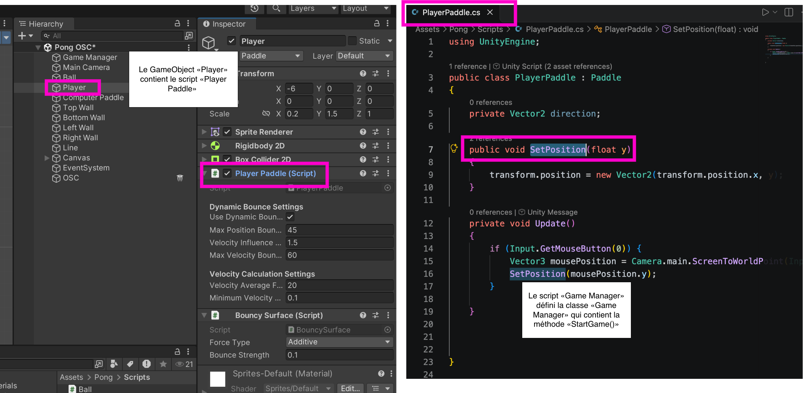
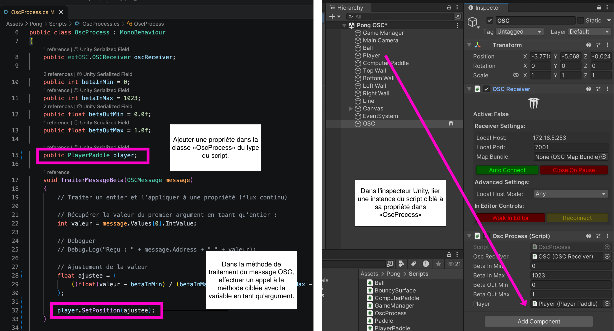

# extOSC Bind : int vers argument float d’une méthode

<!-- toc -->

## Préalables

- Installation d’extOSC, création du `GameObject OSC` et création du script `OscProcess` tel qu’indiqué dans [extOSC](../../../extosc/)

## Effectuer un Bind()

> [!IMPORTANT] 
> Pour chaque adresse OSC différente (`/but0`, `/but1`, `/angle`, `/lumiere`, etc.), vous devez créer **un Bind() différent**.

- Ouvrir le script `OscProcess`.
- Dans la méthode `Start()`, associer l’adresse OSC à une méthode via `Bind()`. 

Dans l’exemple suivant, nous indiquons que lorsque le message `/beta` est reçu, nous déclenchons la méthode `TraiterMessageAlpha` (qui sera définie plus tard) :
```csharp
oscReceiver.Bind("/beta", TraiterMessageAlpha);
```

> [!NOTE]
> Créer un `oscReceiver.Bind()` différent pour **CHAQUE** adresse OSC à traiter.

Si nous devons traiter deux messages différents, comme `/alpha` et `/beta`, nous devons créer deux `Bind()` et ultérieurement deux méthodes de traitement avec des noms différents :
```csharp
oscReceiver.Bind("/alpha", TraiterMessageAlpha);
oscReceiver.Bind("/beta", TraiterMessageBeta);
```

## Définir une méthode de traitement dédiée

Chaque *Bind* nécessite sa propre fonction dédiée avec un nom unique. 

Dans la classe `OscProcess`, nous définissons la méthode de traitement (nommée `TraiterMessageBeta` dans cet exemple) pour recevoir le message OSC et traiter son argument :

```csharp
void TraiterMessageBeta(OSCMessage message)
    {
        // Traiter un entier et l’appliquer à une propriété (flux continu)

        // Récupérer la valeur du premier argument en taant qu’entier :
        int valeur = message.Values[0].IntValue;

        // Deboguer
        // Debug.Log("Reçu : " + message.Address + " " + valeur);

        // Ajustement de la valeur
        float ajustee = (
            ((float)valeur - potInMin) / (potInMax - potInMin) * (potOutMax - potOutMin) + potOutMin
        );
        
        // DESTINATION
    }
```


La méthode de traitement utilise 4 propriétés pour ajuster la valeur reçue. Ces propriétés doivent être ajoutées au début de la classe `OscProcess` (nous utilisons les noms de l’exemple précédent) :
```csharp

    public int betaInMin = 0;
    public int betaInMax = 1023;
    public float betaOutMin = 0.0f;
    public float betaOutMax = 1.0f;
```

> [!NOTE]
> Rappels :
> Créer une méthode de traitement différente pour **CHAQUE** *Bind()*.
> Cette méthode doit avoir le **même nom** que celui utilisé dans le *Bind()*
> La méthode utilise 4 propriétés qui doivent avoir des noms différents des autres méthodes (i.e. créer 4 propriétés pour chaque méthode créée)

## Destination : méthode avec argument float

Dans l’extrait de code ci-haut, nous devons remplacer `// DESTINATION` par un appel à une méthode. Pour ce faire, nous devons :

- Cibler le script et la méthode désirée.
- Ajouter une propriété dans la classe `OscProcess` du type de ce script.
- Dans la méthode de traitement du message OSC, remplacer `// DESTINATION` par un appel à cette méthode avec la variable `ajustee` passée en argument.
- Dans l’inspecteur Unity, lier une instance du script ciblé à sa propriété dans `OscProcess`.

Voici un exemple des étapes en image :



