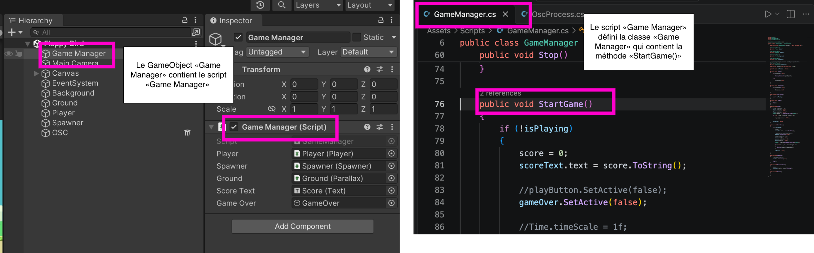
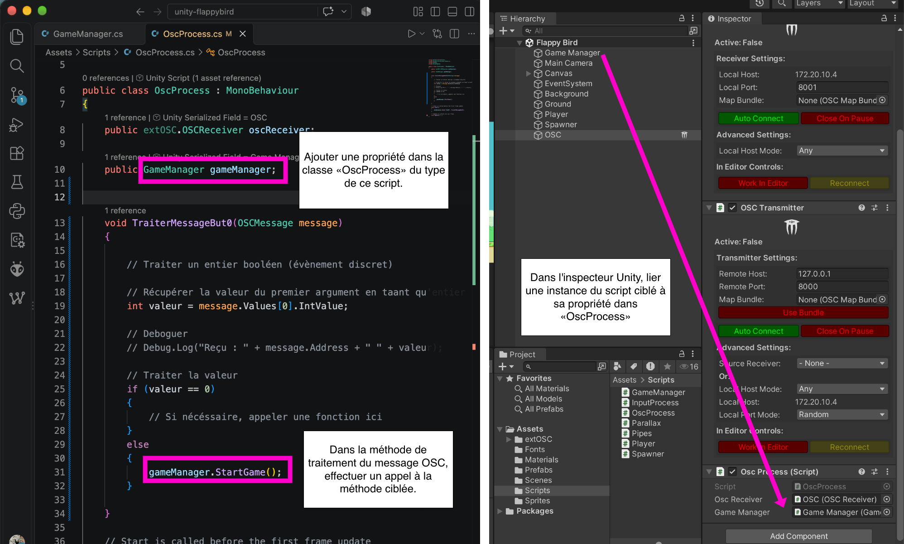

# extOSC Bind : int traité dans un if

<!-- toc -->

## Préalables

- Installation d’extOSC, création du `GameObject OSC` et création du script `OscProcess` tel qu’indiqué dans [extOSC](../../../extosc/)

## Effectuer un Bind()

> [!IMPORTANT] 
> Pour chaque adresse OSC différente (`/but0`, `/but1`, `/angle`, `/lumiere`, etc.), vous devez créer **un Bind() différent**.

- Ouvrir le script `OscProcess`.
- Dans la méthode `Start()`, associer l’adresse OSC à une méthode via `Bind()`. 

Dans l’exemple suivant, nous indiquons que lorsque le message `/alpha` est reçu, nous déclenchons la méthode `TraiterMessageAlpha` (qui sera définie plus tard) :
```csharp
oscReceiver.Bind("/alpha", TraiterMessageAlpha);
```

> [!NOTE]
> Créer un `oscReceiver.Bind()` différent pour **CHAQUE** adresse OSC à traiter.

Si nous devons traiter deux messages différents, comme `/alpha` et `/beta`, nous devons créer deux `Bind()` et ultérieurement deux méthodes de traitement avec des noms différents :
```csharp
oscReceiver.Bind("/alpha", TraiterMessageAlpha);
oscReceiver.Bind("/beta", TraiterMessageBeta);
```


## Définir une méthode de traitement dédiée

Chaque *Bind* nécessite sa propre fonction dédiée avec un nom unique. 

Dans la classe `OscProcess`, nous définissons la méthode de traitement (nommée `TraiterMessageAlpha` dans cet exemple) pour recevoir le message OSC et traiter son argument :

```csharp
void TraiterMessageAlpha(OSCMessage message)
{
    
    // Traiter un entier booléen (évènement discret)

    // Récupérer la valeur du premier argument en taant qu’entier :
    int valeur = message.Values[0].IntValue;

    // Deboguer
    // Debug.Log("Reçu : " + message.Address + " " + valeur);

    // Traiter la valeur
    if ( valeur == 0 ) {
        // Si nécéssaire, appeler une fonction ici
    } else {
        // Si nécéssaire, appeler une fonction ici
    }

}
```

> [!NOTE]
> Créer une méthode de traitement différente pour **CHAQUE** *Bind()*.
> Cette méthode doit avoir le **même nom** que celui utilisé dans le *Bind()*


## Destination : appel de fonction

Dans l’extrait de code ci-haut, nous pouvons remplacer `// Si nécéssaire, appeler une fonction ici` par un appel de fonction pour déclencher de quoi dans Unity. Pour ce faire, nous devons :

- Cibler le script et la méthode désirée.
- Ajouter une propriété dans la classe `OscProcess` du type de ce script.
- Dans la méthode de traitement du message OSC, remplacer `// Si nécéssaire, appeler une fonction ici` par un appel à cette méthode.
- Dans l’inspecteur Unity, lier une instance du script ciblé à sa propriété dans `OscProcess`.

Voici un exemple des étapes en image :





