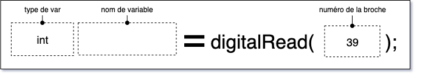

# M5Stack Atom Lite : Bouton intégré 

## Introduction

Le bouton est relié à la broche `39` de l'ESP32 du Atom Lite.

## Code à intégrer

### Dans l'espace global

Bien que cela ne soit pas absolument nécessaire, c'est une bonne idée d'utiliser un `#define` pour identifier le numéro de la broche :
```cpp
#define BROCHE_ATOM_BOUTON 39
```

### Dans *setup()*

S'assurer que la broche reliée au bouton est en mode entrée :
```cpp
pinMode( BROCHE_ATOM_BOUTON , INPUT );
```

### Dans *loop()*


Pour effectuer une lecture, nous utilisons la fonction [digitalRead()](https://docs.arduino.cc/learn/programming/reference/) :
```cpp
int maLectureAtomBouton = digitalRead( BROCHE_ATOM_BOUTON );
```



