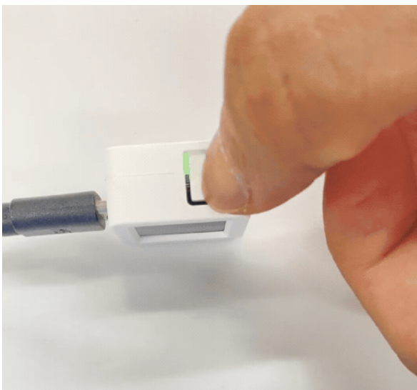

# AtomS3

## Introduction

L’**AtomS3** est un microcontrôleur compact de la série Atom de **M5Stack**. Il intègre le microprocesseur **ESP32-S3** d’Espressif, offrant des performances élevées ainsi qu’une connectivité **Wi-Fi** et **Bluetooth Low Energy (BLE)**. Il dispose de **8 Mo de mémoire Flash** et un **port USB-C**.

L’**AtomS3** est disponible en deux versions :
- Version sans écran (lite) qui intègre :
   - une **LED RGB programmable** pour l’affichage d’états,
   - un **bouton utilisateur**,
   - un **émetteur infrarouge (IR)** pour le contrôle d’appareils compatibles.
- Version avec écran qui intègre :
   - un **écran IPS couleur de 0,85 pouce** avec une résolution de **128 × 128 pixels** pour l’affichage d’informations ou d’interfaces utilisateur simples,  
   - un **capteur inertiel 6 axes (MPU6886)** intégré pour la détection de mouvements et l’orientation,  
   - un **bouton programmable** situé sous l’écran,  


Pages officielles :
- Version du matériel AtomS3 avec écran : [AtomS3](https://docs.m5stack.com/en/core/AtomS3)
- Version du matériel AtomS3 sans écran  : [AtomS3-Lite](https://docs.m5stack.com/en/core/AtomS3%20Lite)

## Broches


## Intégration dans PlatformIO

### Utiliser la plateforme de la communauté fournie par `pioarduino`

```ini
[env:m5stack-atoms3]
platform = https://github.com/pioarduino/platform-espressif32/releases/download/stable/platform-espressif32.zip
board = m5stack-atoms3
framework = arduino
monitor_speed = 115200
```

### Activer la communication série USB `Serial`

- L'**ESP32-S3** ne dépend **pas**, comme les modèles **ESP32** précédents, de puce de conversion USB-UART externe pour gérer la communication série USB `Serial` (comme les puces FTDI, CP2102 ou CH340).
- L'**ESP32-S3** possède un contrôleur **USB natif** qui peut apparaître comme un **port COM virtuel**, aussi appelé **USB Communication Device Class** (**USB CDC**) sur l'ordinateur.  
- La fonction `Serial` d'Arduino peut être mappée sur ce **USB CDC**.
- Pour activer le **port USB CDC**, il faut utiliser les **build flags** suivants dans `platformio.ini` :
```ini
build_flags =
   -DARDUINO_USB_CDC_ON_BOOT=1   ; activer le CDC USB au démarrage
   -DARDUINO_USB_MODE=0          ; CDC USB en mode périphérique (comme un Arduino Leonardo/Micro classique)
```
#### Autres modes USB

L’ESP32-S3 peut se présenter comme de nombreux types de périphériques USB, tels que des contrôleurs MIDI, des souris, des claviers, des manettes de jeu, etc. En revanche, les différents modes USB sont très peu documentés. Espressif met toutefois à disposition plusieurs exemples, disponibles ici : [arduino-esp32/libraries/USB at master · espressif/arduino-esp32](https://github.com/espressif/arduino-esp32/tree/master/libraries/USB)

### Activer le mode pour le téléversement

Pour téléverser le code, il faut maintenir le bouton de réinitialisation au moins 2 secondes jusqu’à ce que la DEL interne verte s’allume, puis relâcher. L’appareil est maintenant en mode de téléversement.



Après avoir téléversé le code, appuyer rapidement de nouveau sur le bouton pour lancer l'exécution du code.

## Schéma électronique

