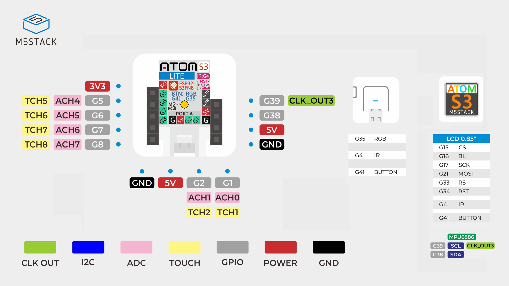

# AtomS3


## Introduction

Pages officielles :
- Version du matériel AtomS3 avec écran : [AtomS3](https://docs.m5stack.com/en/core/AtomS3)
- Version du matériel AtomS3 sans écran  : [AtomS3-Lite](https://docs.m5stack.com/en/core/AtomS3%20Lite)


## Broches




## Intégration dans PlatformIO

### Utiliser la plateforme de la communauté fournie par `pioarduino`

```ini
[env:m5stack-atoms3]
platform = https://github.com/pioarduino/platform-espressif32/releases/download/stable/platform-espressif32.zip
board = m5stack-atoms3
framework = arduino
monitor_speed = 115200
```

### Activer la communication série USB `Serial`

- L'**ESP32-S3** ne dépend **pas**, comme les modèles **ESP32** précédents, de puce de conversion USB-UART externe pour gérer la communication série USB `Serial` (comme les puces FTDI, CP2102 ou CH340).
- L'**ESP32-S3** possède un contrôleur **USB natif** qui peut apparaître comme un **port COM virtuel**, aussi appelé **USB Communication Device Class** (**USB CDC**) sur l'ordinateur.  
- La fonction `Serial` d'Arduino peut être mappée sur ce **USB CDC**.
- Pour activer le **port USB CDC**, il faut utiliser les **build flags** suivants dans `platformio.ini` :
```ini
build_flags =
   -DARDUINO_USB_CDC_ON_BOOT=1   ; activate USB CDC
   -DARDUINO_USB_MODE=0          ; USB CDC in device mode only (like a classic Arduino Leonardo/Micro)
```


## Schéma électronique

