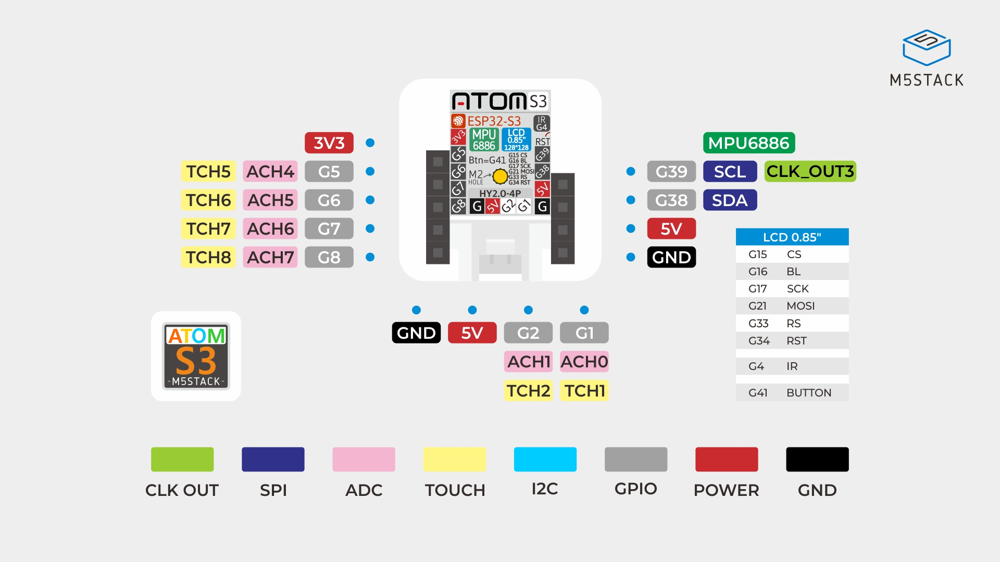

# AtomS3




## Communication série (Serial) USB avec l'ordinateur

- L'**ESP32-S3** dispose d'un contrôleur USB natif qui gère le **USB CDC/JTAG**.  
- Le port **USB natif** de l'AtomS3 apparaît comme un **port COM virtuel** sur l'ordinateur.  
- La fonction `Serial` d'Arduino peut être mappée sur ce **port USB CDC**, sans passer par un convertisseur USB-UART externe.  
- Pour activer l'USB CDC, il faut utiliser les **build flags** suivants dans `platformio.ini` :

```ini
build_flags =
   -DARDUINO_USB_MODE=1          ; active USB CDC + JTAG
   -DARDUINO_USB_CDC_ON_BOOT=1   ; énumération USB CDC au démarrage
```

## Communication série UART avec des modules/périphériques

### Dans l'espace global

```cpp
#include <HardwareSerial.h>

// Création d'objets HardwareSerial pour UART1 et UART2
HardwareSerial MySerial1(1);  // UART1
HardwareSerial MySerial2(2);  // UART2
```

### Initialisation

```cpp
  // UART1 : TX sur GPIO10, RX sur GPIO9, baudrate 115200
  MySerial1.begin(115200, SERIAL_8N1, 9, 10);

  // UART2 : TX sur GPIO17, RX sur GPIO16, baudrate 9600
  MySerial2.begin(9600, SERIAL_8N1, 16, 17);
```