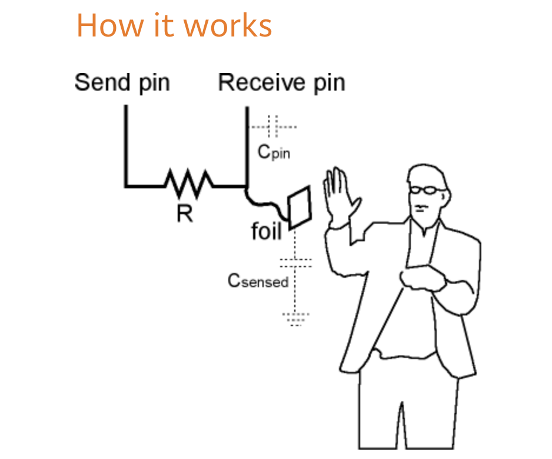
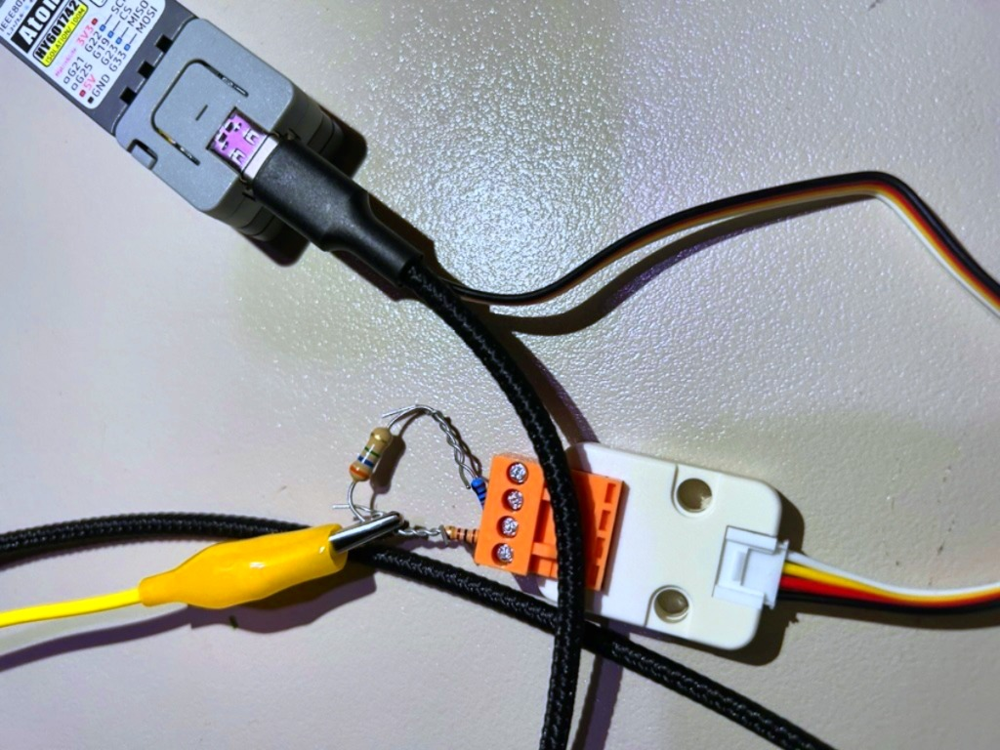

# Mesure de capacitance avec un ESP32



## Circuit



## Code

```cpp

#include <M5Atom.h>  // Inclure la librairie M5 (version pour M5Atom) https://github.com/m5stack/M5Atom
CRGB pixel;  // CRGB est défini par FastLed https://github.com/FastLED/FastLED/wiki/Pixel-reference#crgb-reference

unsigned long myCapacitanceChrono;

void setup() {

  M5.begin(false, false, false);                      // Démarrer la libraire M5 avec toutes les options désactivées
  Serial.begin(115200);                               // Démarrer la connexion sérielle avec l'ordinateur
  FastLED.addLeds<WS2812, DATA_PIN, GRB>(&pixel, 1);  // Ajouter le pixel du M5Atom à FastLED

  // Animation de démarrage
  while (millis() < 5000) {
    // Allumer le pixel et attendre 100 millisecondes
    pixel = CRGB(255, 255, 255);
    FastLED.show();
    delay(100);
    // Éteindre le pixel et attendre 100 millisecondes
    pixel = CRGB(0, 0, 0);
    FastLED.show();
    delay(100);
  }
}

int readCapacitance() {
  int cycles = 0;
  // POWER CYCLE THE PINS
  pinMode(26, OUTPUT);
  digitalWrite(26, LOW);
  pinMode(32, OUTPUT);
  digitalWrite(32, LOW);
  delayMicroseconds(10);
  pinMode(32, INPUT);
  digitalWrite(26, HIGH);

  // WAIT TILL INPUT PIN GOES HIGH
  while (cycles < 5000) {
    if (digitalRead(32) == HIGH) break;
    cycles++;
  }
  return cycles;
}

void loop() {
  if ( millis() - myCapacitanceChrono > 50 ) {
    myCapacitanceChrono = millis();

    int capacitance = readCapacitance();

    Serial.println(capacitance);

  }
}
```