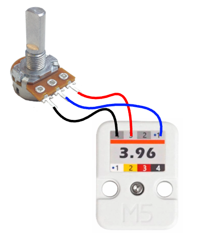

# M5Stack Unit 3.96 et potentiomètre

<!-- toc -->

## Introduction

Un potentiomètre standard possède **trois broches** :

- Une broche reliée au **5V (ou 3.3V)**  
- Une broche reliée au **GND**  
- Une broche centrale appelée **curseur (signal)**  

Le curseur fournit une tension variable comprise entre 0V et 5V (ou 3.3V selon la carte), selon la position de rotation du potentiomètre.


## Branchement générique

- Les deux broches extérieures peuvent être inversées (cela inversera simplement le sens de variation).
- La broche centrale doit être reliée à une **entrée analogique**.

Le branchement du potentiomètre à un microcontrôleur se fait selon la logique suivante :

| Potentiomètre | Microcontrôleur |
|--------------|-----------------|
| Broche extérieure | 5V (ou 3.3V) |
| Broche centrale (curseur) | Entrée analogique |
| Autre broche extérieure | GND |

## Branchement au 3.96

**Une petite complication** : La sortie #3/Rouge du 3.96 fournit 5 V. Les entrées analogiques sont limitées à 3.3 V. Il faut réduire le 5 V à 3.3 V avec un diviseur de tension avec deux résistances, une de 3.3k et l'autre de 1.8k.


Pour le Unit 3.96 la logique de connexion générique, et du diviseur de tension, correspondent aux connexions suivantes :

| Potentiomètre | Unit 3.96 | Résistance 1.8k | Résistance 3.3k |
|--------------|------------|--------------|------------|
| Broche extérieure | #3 / Rouge  |  |   |
| | #1 / Blanc  | Une broche de la résitance  | Une broche de la résitance |
| Broche centrale |  | | Autre broche de la résitance  |
| Autre broche extérieure | #4 / Noir / GND| Autre broche de la résitance  | |



## Code dans le cas d’un Unit 3.96 branché directement à l’Arduino


Définition de la broche analogique correspondant au fil blanc du Unit 3.96  
(exemple pour un Atom Lite) :

```cpp
#define POTENTIOMETER_PIN 32
```

### Code d'initialisation

Aucune initialisation particulière n’est requise.

### Code d'utilisation

Lecture de la valeur :
```cpp
int valeur = analogRead(POTENTIOMETER_PIN);
```


## Code dans le cas d’un Unit 3.96 branché à un PbHub

Lorsqu'un PbHub est utilisé il faut indiquer le numéro de canal. Voici le cas si le Unit 3.96 est branché au canal `1` :

```cpp
#define POT_CHAN 1
```

### Code d'initialisation

Aucune initialisation particulière n’est requise.

### Code d'utilisation

Lecture de la valeur :
```cpp
int valeur = myPbHub.analogRead(POT_CHAN);
```