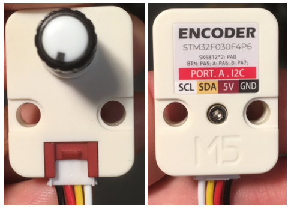

# M5Stack Unit Encoder

## Introduction



Le [M5Stack Unit Encoder](https://docs.m5stack.com/en/unit/encoder) est un capteur de rotation infinie équipé de 2 pixels RGB.

C'est un *Unit* de type I²C tel qu'identifié par son connecteur rouge.

> [!NOTE]
> Il doit être connecté au M5Stack Grove HUB ou directement au microcontrôleur!

Un cran (Ticks / Pulses) est l'unité de mesure fondamentale d'un encodeur rotatif. C'est le plus petit mouvement angulaire que l'encodeur peut détecter. Pour chaque cran, le capteur génère une impulsion électrique.

## Bibliothèque M5_Encoder

La bibliothèque [thomasfredericks/M5_Encoder](https://github.com/thomasfredericks/M5_Encoder) permet d'interfacer avec ce _unit_.

###  Installation

#### Dans PlatformIO

Dans le fichier **platformio.ini** ajouter à la section `lib_deps` : 

```
lib_deps =
    https://github.com/thomasfredericks/M5_Encoder.git
```

> [!WARNING]
> Il est important de respecter la disposition et l'indentation de la section lib_deps!

### Code obligatoire à ajouter à **l'espace global**

Importer et créer une instance de la classe `M5_Encoder` (nommée `myEncoder` dans cet exemple) :
```cpp
#include <M5_Encoder.h>
M5_Encoder myEncoder;
```


### Code obligatoire à ajouter à `setup()`

S'assurer que `Wire` est initialisé : 
```cpp
  Wire.begin();
```

> [!WARNING] 
> Ne pas initialiser Wire deux fois dans votre code!

Démarrer `myEncoder` : 
```cpp
  myEncoder.begin();
```

### Code obligatoire à mettre dans `loop()`

Il est nécessaire de mettre à jour les valeurs de l'encodeur avant de les récupérer. Il faut ainsi appeler la méthode `myEncoder.update()` à chaque `loop()`.
```cpp
    // Mise à jour des valeurs de l'encodeur. 
    // Doit être appelé régulièrement.
    // Doit être appelé avant de lire les valeurs.
    myEncoder.update();
```

### Lecture de la rotation

La rotation représente la somme de tous les crans accumulés par l'encodeur depuis le démarrage du programme :
 - Si l'encodeur est tourné dans le sens horaire, la valeur augmente.
 - Si l'encodeur est tourné dans le sens anti-horaire, la valeur diminue.
  


Une note à propos des valeurs limites : 
 - Si l'encodeur continue de tourner dans le sens horaire, rendue à 32 767, elle tombe à -32 768 à la prochaine rotation
 - Si l'encodeur continue de tourner dans le sens anti-horaire, rendue à -32 768, elle va déborder et passer à sa valeur maximale 32 767 à la prochaine rotation.

Obtenir la rotation accumulée de l'encodeur :
```cpp
    // Lecture de la rotation de l'encodeur
    int valeurEncodeur = myEncoder.getEncoderRotation();
```

### Lecture du changement de rotation

Le changement de rotation est un entier qui peut être :
 - Positif : L'encodeur a tourné de N crans dans le sens horaire depuis le dernier appel à `myEncoder.update()`.
 - Négatif : L'encodeur a tourné de N crans dans le sens anti-horaire depuis le dernier appel à `myEncoder.update()`.
 -  Zéro : L'encodeur est resté immobile (ou est revenu exactement à sa position précédente).

La méthode `getEncoderChange()` fournit la vitesse angulaire effective (exprimée en crans par intervalle de mise à jour) qui s'est produite depuis le dernier rafraîchissement.

Obtenir le changement de rotation de l'encodeur :
```cpp
   // Lecture du changement depuis la dernière lecture
    int changementEncodeur = myEncoder.getEncoderChange();
```

### Lecture du bouton

Obtenir l'état du bouton :
```cpp
     // Lecture du bouton 
    int etatBouton = myEncoder.getButtonState();
```

### Écriture des pixels

Les deux pixels :
```cpp
// Changer la couleur des deux pixels
// CHANGER ROUGE, VERT, BLEU pour des valeurs entre 0 et 255 (inclusivement)
myEncoder.setLEDColorBoth( ROUGE, VERT, BLEU );
```

Pixel de gauche :
```cpp
// Changer la couleur du pixel de gauche
// CHANGER ROUGE, VERT, BLEU pour des valeurs entre 0 et 255 (inclusivement)
myEncoder.setLEDColorLeft( ROUGE, VERT, BLEU );
```

Pixel de droite :
```cpp
// Changer la couleur du pixel de droite
// CHANGER ROUGE, VERT, BLEU pour des valeurs entre 0 et 255 (inclusivement)
myEncoder.setLEDColorRight( ROUGE, VERT, BLEU );
```
