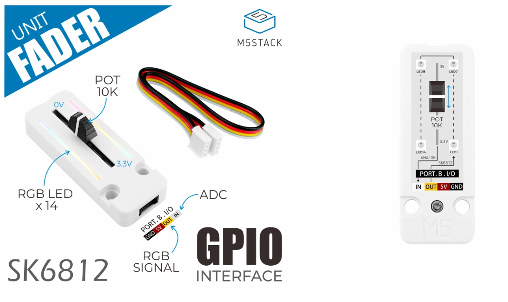

# M5Stack Fader Unit

## Description

L'unité **M5Stack Fader Unit** est équipé d'un potentiomètre linéaire (_slider_ ou _fader_ en anglais) et de 14 pixels.

Broches :
- **ANALOG/ADC/IN** / fil blanc du câble Grove : permet la lecture du potentiomètre linéaire 
- **SK6812/RGB SIGNAL/OUT** / fil jaune du câble Grove : permet de contrôler les 14 pixels



## Connexion

### Touche
- La lecture du potentiomètre s'effectue sur la broche identifiée par le texte *ANALOG*,  *ADC* ou *IN* sur fond blanc, ce qui correspond au fil blanc du câble Grove. 
- Si l'unité **M5Stack Fader Unit** est connectée directement au Atom Lite, c'est la broche 32 du Atom  qui permet d'effectuer la lecture numérique analogique du potentiomètre.

### Pixels
- Le contrôle des pixels s'effectue avec la broche identifiée par le texte **SK6812/RGB SIGNALOUT** ou **OUT** sur fond jaune, ce qui correspond au fil jaune du câble Grove. 
- Si l'unité **M5Stack Fader Unit** est connectée directement au Atom Lite, c'est la broche 26 (identifiée G26) qui permet de contrôler les pixels.

## Bibliothèque

Le contrôle du pixel nécessite la bibliothèque suivante :
- FastLED 

### PlatformIO **platformio.ini**
```
lib_deps =
    FastLED
```

## Code à intégrer

### Dans l'espace global

Ajouter la bibliothèque FastLED:
```cpp
#include <FastLED.h>
```

Bien que cela ne soit pas absolument nécessaire, c'est une bonne idée d'utiliser des `#define` pour identifier les numéros de broches :
```cpp
#define BROCHE_ATOM_FIL_BLANC 32
#define BROCHE_ATOM_FIL_JAUNE 26
```

Ajouter une variable de type CRGB Array pour le pixel du **M5Stack Fader Unit** :
```cpp
#define FADER_PIXELS_COUNT 14
CRGB faderPixels[FADER_PIXELS_COUNT];
```
### Dans *setup()*

Initialiser FastLED pour le pixel du **M5Stack Fader Unit** :
```cpp
  FastLED.addLeds<WS2812, BROCHE_ATOM_FIL_JAUNE, GRB>(faderPixels, FADER_PIXELS_COUNT);
```

Initialiser l'entrée du **M5Stack Fader Unit** :
```cpp
  pinMode( BROCHE_ATOM_FIL_BLANC , INPUT );
```

### Dans *loop()*

#### Lecture de la touche 

Pour effectuer une lecture, nous utilisons la fonction [analogRead()](https://docs.arduino.cc/learn/programming/reference/) :
```cpp
int maLectureAnalogique = analogRead( BROCHE_ATOM_FIL_BLANC );
```

#### Pixels

Pour changer les couleurs des pixels :

1) Assigner une ou des couleurs type CRGB (couleur rouge, vert, bleu [RGB Color Codes Chart 🎨](https://www.rapidtables.com/web/color/RGB_Color.html))
2) Appeler `FastLED.show()`

##### Assigner une couleur à un pixel

```cpp
  // Changer la couleur d'un pixel -----|
  int indexDuPixel = 7; // Ici nous choisissons le huitième pixel (index # 7)
  faderPixels[indexDuPixel] = CRGB(255, 0, 0); // ROUGE
  // -----------------------------------|
  // NE PAS OUBLIER FastLED.show() après avoir assigné les nouvelles couleurs
```

##### Assigner une couleur à tous les pixels


```cpp
  // Changer la couleur de tous les pixels -----|
  for (int i =0; i < FADER_PIXELS_COUNT; i++) {
      faderPixels[i] = CRGB(255, 0, 0); // ROUGE
  }
  // -------------------------------------------|
  // NE PAS OUBLIER FastLED.show()
  // NE PAS OUBLIER FastLED.show() après avoir assigné les nouvelles couleurs
```

