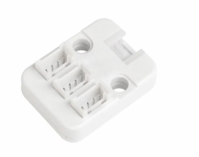

# Grove Hub

## Introduction

Page officielle du produit : [Unit Hub](https://docs.m5stack.com/en/unit/hub)

Le **Grove Hub** permet de relier 3 modules **I2C/Wire** (qui sont reconnaissables à leur connecteur rouge) à 1 connecteur d'un microcontrôleur M5 Stack.

> [!NOTE]
> Le Grove Hub est un module passif. Utiliser le module PaHub pour un module actif.

## Gestion des Adresses I2C

Si des modules **I2C/Wire** sont connectés au **Grove Hub**, ils doivent impérativement avoir des **adresses I2C différentes**. Le Hub n'est qu'un simple répartiteur de câblage et ne gère pas de commutation d'adresses. 

> [!WARNING]
> Les Units de même modèle ont la même adresse I2C/Wire par défaut.
> * Si les Units connectés sont tous de modèles différents, il n'y aura généralement pas de problème.
> * Si vous connectez plusieurs Units **du même modèle** (par exemple, deux capteurs de température identiques), il est **nécessaire de changer manuellement** l'adresse I2C/Wire du deuxième (et du troisième) module identique, souvent en modifiant une résistance (méthode matérielle) ou via un logiciel si le module le permet.

