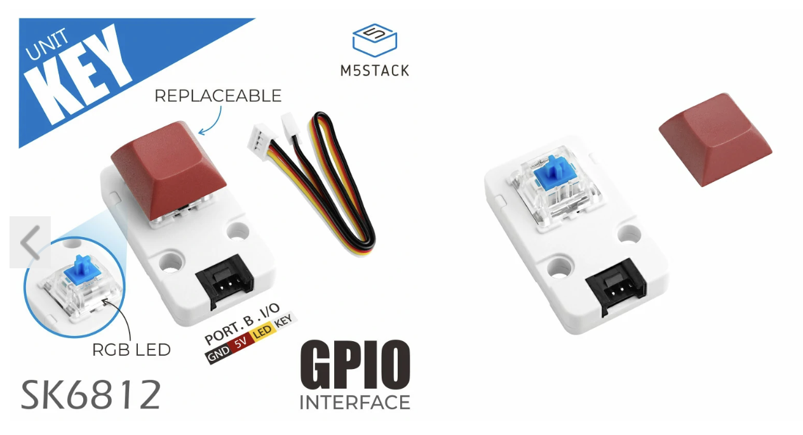
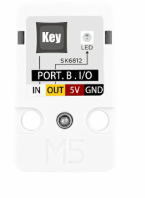

# M5Stack Key Unit

## Description

L'unité **M5Stack Key Unit** est une unité d'entrée à une touche mécanique tactile avec un pixel RGB intégré. 

L’unité expose deux interfaces numériques : l’une pour la détection de l’état de la touche (`KEY` ou `IN`), l’autre pour le contrôle du pixel (`LED` ou `OUT`).





## Connexion

### Touche
- La lecture de la touche s'effectue sur la broche identifiée par le texte *KEY* sur fond blanc, ce qui correspond au fil blanc du câble Grove. 
- Si l'unité **M5Stack Key Unit** est connectée au connecteur blanc du Atom Lite, c'est la broche 32 (identifiée G32) qui permet d'effectuer la lecture numérique de la touche.

### Pixel
- Le contrôle du pixel s'effectue sur la broche identifiée par le texte *LED* sur fond jaune, ce qui correspond au fil jaune du câble Grove. 
- Si l'unité **M5Stack Key Unit** est connectée au connecteur blanc du Atom Lite, c'est la broche 26 (identifiée G26) qui permet de contrôler le pixel.

## Bibliothèque

Le contrôle du pixel nécessite la bibliothèque suivante :
- FastLED 

### PlatformIO **platformio.ini**
```
lib_deps =
    FastLED
```

## Code à intégrer

### Dans l'espace global

Ajouter la bibliothèque FastLED:
```cpp
#include <FastLED.h>
```

Bien que cela ne soit pas absolument nécessaire, c'est une bonne idée d'utiliser des `#define` pour identifier les numéros de broches :
```cpp
#define BROCHE_ATOM_FIL_BLANC 32
#define BROCHE_ATOM_FIL_JAUNE 26
```

Ajouter une variable de type CRGB pour le pixel du **M5Stack Key Unit** :
```cpp
CRGB keyPixel;
```
### Dans *setup()*

Initialiser FastLED pour le pixel du **M5Stack Key Unit** :
```cpp
  // Initialiser FastLED pour contrôler le pixel RGB du M5Stack Key Unit
  FastLED.addLeds< WS2812, BROCHE_ATOM_FIL_JAUNE , GRB >(&keyPixel, 1); 
```

Initialiser l'entrée du **M5Stack Key Unit** :
```cpp
  pinMode( BROCHE_ATOM_FIL_BLANC , INPUT );
```

### Dans *loop()*

#### Lecture de la touche 

Pour effectuer une lecture, nous utilisons la fonction [digitalRead()](https://docs.arduino.cc/learn/programming/reference/) :
```cpp
int maLectureKey = digitalRead( BROCHE_ATOM_FIL_BLANC );
```

#### Pixel

Pour changer la couleur du pixel :

1) On assigne une nouvelle valeur de couleur de type CRGB (couleur rouge, vert, bleu [RGB Color Codes Chart 🎨](https://www.rapidtables.com/web/color/RGB_Color.html)) à la variable :
```cpp
  keyPixel = CRGB(255,255,255); // BLANC
```

2) Après, il faut mettre à jour le pixel
```cpp
    FastLED.show();
```