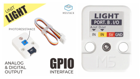
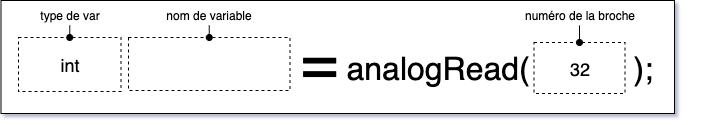

# M5Stack Light Unit

## Description

L'unité **M5Stack Light** permet de mesurer une quantité de lumière à l'aide d'une photorésistance.



## Connexion

Connecter l'unité **M5Stack Light** au connecteur Grove blanc du contrôleur.

La lecture de lumière s'effectue sur la broche identifiée par le texte *IN* sur fond blanc, ce qui correspond au câble blanc du connecteur Grove. Si l'unité **M5Stack Light** est connectée au connecteur blanc du Atom Lite, c'est la broche 32 (identifiée G32) qui permet d'effectuer la lecture analogique de l'angle.


## Code à intégrer

### Dans l'espace global

Bien que cela ne soit pas absolument nécessaire, c'est une bonne idée d'utiliser un `#define` pour identifier le numéro de la broche :
```cpp
#define MA_BROCHE_LUMIERE 32
```

### Dans *setup()*

Le **M5Stack Light** ne nécessite aucun code dans *setup()*.

### Dans *loop()*

Pour effectuer une lecture, nous utilisons la fonction [analogRead()](https://docs.arduino.cc/learn/programming/reference/) :
```cpp
int analogRead(int pin);
```

Donc *si* le **M5Stack Light** est connecté au connecteur Grove du contrôleur :
```cpp
int maLectureLumiere = analogRead(MA_BROCHE_LUMIERE);
```
ou
```cpp
int maLectureLumiere = analogRead(32);
```


