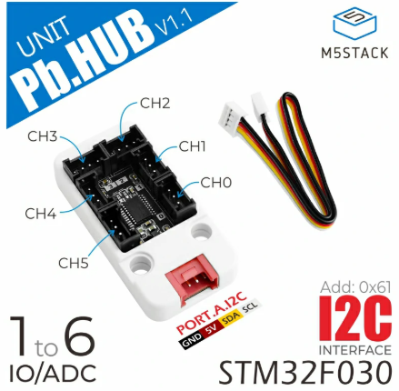

# M5Stack PbHub Unit

## Introduction

Le [M5Stack PbHub v1.1](https://docs.m5stack.com/en/unit/pbhub_1.1) permet de brancher jusqu'à 6 M5Stack UNITS équipés d'un connecteur **noir**. Il nécessite une utilisation d'une bibliothèque (voir plus bas).




## Bibliothèque M5_PbHub

### Installation

#### Arduino IDE

La bibliothèque [M5_PbHub](https://github.com/thomasfredericks/M5_PbHub) est disponible dans le gestionnaire de bibliothèques d'Arduino.

#### PlatformIO

Dans le fichier **platformio.ini** ajouter à la section `lib_deps` (ajouter cette catégorie si elle est absente) : 
```
lib_deps =
    thomasfredericks/M5_PbHub@^0.1.4
```
ou
```
lib_deps =
    M5_PbHub
```

> [!WARNING]
> Il est important de respecter la disposition et l'indentation de la section lib_deps!


### Code à ajouter à **l'espace global**

Importer et créer une instance de la classe `M5_PbHub` (nommée `myPbHub` dans cet exemple) :
```cpp
#include <M5_PbHub.h>
M5_PbHub myPbHub;
```

| Unit | Sans PbHub | Avec PbHub | 
| --- | --- | --- |
| [Light Unit](../light/) | | `#include <M5_PbHub.h>` et `M5_PbHub myPbHub` |
| [Angle Unit](../angle/) |  | `#include <M5_PbHub.h>` et `M5_PbHub myPbHub` |
| [Key Unit](../key/) | `#include <FastLED.h>` et `CRGB keyPixel` | `#include <M5_PbHub.h>` et `M5_PbHub myPbHub` |

### Code à ajouter à `setup()`

S'assurer que `Wire` est initialisé : 
```cpp
Wire.begin();
```

> [!WARNING] 
> Ne pas initialiser Wire deux fois dans votre code!

Démarrer `myPbHub` : 
```cpp
myPbHub.begin();
```

**Optionnellement**, initialiser les pixels des Units connectés au **PbHub** en indiquant le nombre de pixels:
```cpp
myPbHub.setPixelCount( uint8_t channel ,  uint16_t count );
```
| Unit | Sans PbHub | Avec PbHub | 
| --- | --- | --- |
| [Light Unit](../light/) | | `Wire.begin()` et `myPbHub.begin()` |
| [Angle Unit](../angle/) |  | `Wire.begin()` et `myPbHub.begin()`  |
| [Key Unit](../key/) | `FastLED.addLeds< WS2812, BROCHE , GRB >(&keyPixel, 1)` et `pinMode( BROCHE , INPUT_PULLUP )` | `Wire.begin()` et `myPbHub.begin()`  et `myPbHub.setPixelCount( CANAL , 1)` |

### Méthodes à utiliser dans `loop()`

#### Lecture

| Unit | Sans PbHub | Avec PbHub | 
| --- | --- | --- |
| [Light Unit](../light/) | `analogRead( BROCHE )` | `myPbHub.analogRead( CANAL )` |
| [Angle Unit](../angle/) | `analogRead( BROCHE )` | `myPbHub.analogRead( CANAL )` |
| [Key Unit](../key/) | `digitalRead( BROCHE )` | `myPbHub.digitalRead( CANAL )` |

Lecture numérique de la tension de la broche `I` du canal spécifié :
```cpp
int value = myPbHub.digitalRead(uint8_t channel);
```

Lecture  analogique de la tension de la broche `I` du canal spécifié :
```cpp
int value = myPbHub.analogRead(uint8_t channel);
```


#### Écriture

Écriture numérique de la tension sur la broche `O` du canal spécifié :
```cpp
myPbHub.digitalWrite(uint8_t channel, uint8_t  value);
```

Écriture du PWM de la broche `O` du canal spécifié :
```cpp
myPbHub.analogWrite(uint8_t channel, uint8_t pin, uint8_t  pwm);
```

#### Pixels 

| Unit | Sans PbHub | Avec PbHub | 
| --- | --- | --- |
| [Key Unit](../key/) | `keyPixel = CRGB(R,G,B)` et `FastLED.show()` | `myPbHub.setPixelColor( CANAL , 0 , R,G,B );` |

Définir la couleur r, g, b du pixel à cet index du canal spécifié :
```cpp
myPbHub.setPixelColor(uint8_t channel, uint16_t index, uint8_t r,int8_t g, uint8_t b);
```

À partir du pixel à cet index, assigner la même couleur RGB à un certain nombre de pixels sur le canal spécifié : 
```cpp
myPbHub.fillPixelColor(uint8_t channel, uint16_t start, uint16_t index, uint8_t r,int8_t g, uint8_t b);
```
