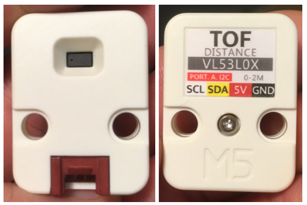

# M5Stack Unit TOF

## Introduction



Le [M5Stack Unit TOF](https://docs.m5stack.com/en/unit/tof) permet de mesurer des distances jusqu'à 2 mètres avec la technologie *Time of Flight*. 

## Connexion

**Le Unit TOF est de type I²C tel qu'identifié par son connecteur rouge.**

Il peut être branché à un connecteur **grove blanc** ou à une connecteur **grove rouge**.

## Bibliothèque vl53l0x de Polulu 

La bibliothèque [vl53l0x de Polulu](https://github.com/pololu/vl53l0x-arduino) permet d'interfacer avec le [M5Stack Unit TOF](https://docs.m5stack.com/en/unit/tof).

###  Installation dans Arduino IDE

La bibliothèque [vl53l0x-arduino](https://github.com/pololu/vl53l0x-arduino) est disponible dans le gestionnaire de bibliothèques d'Arduino.

### Installation dans PlatformIO

Ajouter `pololu/VL53L0X` à l'entrée `lib_deps` du fichier *platform.ini* :
```
lib_deps =
     pololu/VL53L0X
```

## Utilisation

### Code à ajouter à l'espace global

Importer la bibliothèque et créer une instance de la classe `VL53L0X` :
```cpp
#include <VL53L0X.h>
VL53L0X  myTOF;
```

### Code à ajouter à `setup()`

Dans `setup()`, démarrer la connexion I2C (si elle n'a pas déjà été démarrée) :
```cpp
Wire.begin();
```

> [!WARNING] 
> Ne pas initialiser Wire deux fois dans votre code!


Ensuite, initialiser le TOF :
```cpp
  myTOF.init();
```

#### Configuration optionnelle : Longue distance

Cela augmente la sensibilité du capteur et étend sa portée potentielle, mais cela augmente également la probabilité d'obtenir une lecture inexacte en raison de réflexions provenant d'objets autres que la cible visée. Ce mode fonctionne mieux dans des conditions sombres.

```cpp
  // lower the return signal rate limit (default is 0.25 MCPS)
  sensor.setSignalRateLimit(0.1);
  // increase laser pulse periods (defaults are 14 and 10 PCLKs)
  sensor.setVcselPulsePeriod(VL53L0X::VcselPeriodPreRange, 18);
  sensor.setVcselPulsePeriod(VL53L0X::VcselPeriodFinalRange, 14);
```

#### Configuration optionnelle : Vitesse

Vitesse plus élevée au détriment de la précision. Le TOF prend 20 ms pour prendre une mesure (plutôt que 33 ms par défaut).

```cpp
sensor.setMeasurementTimingBudget(20000);
```

#### Configuration optionnelle : Précision

Précision plus élevée au détriment de la vitesse. Le TOF prend 200 ms pour prendre une mesure.

```cpp
sensor.setMeasurementTimingBudget(200000);
```

### Code à utiliser dans `loop()`

À noter qu'une mesure prend par défaut 33 millisecondes !

Obtenir la mesure en millimètres :
```cpp
int mesure = myTOF.readRangeSingleMillimeters();
```

**Optionnellement**, déterminer s'il y a eu une erreur de communication avec le TOF :
```cpp
int erreur = myTOF.timeoutOccurred();
```

