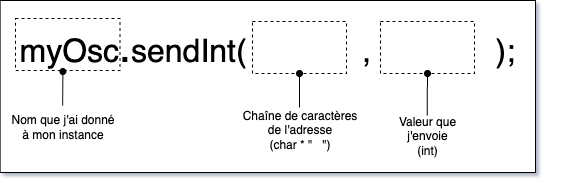

# MicroOsc : Envoi

## Préalable(s)

- [Initialisation de MicroOsc](../initialisation/)
- Cette documentation assume une instance de `MicroOsc` nommée `monOsc`

## Envoi avec MicroOsc

`MicroOsc` permet d’envoyer plusieurs types de données à un destinataire OSC. Les plus utilisés sont :  

- **`int`** : entier 32 bits (`int32_t`)  
- **`float`** : nombre réel à virgule flottante  

Pour envoyer une donnée, il suffit d’utiliser la méthode qui correspond au type de la donnée, par exemple `monOsc.sendInt(address, value)` ou `monOsc.sendFloat(address, value)`.  

Cependant, avant de déclencher l’action d’envoi, il est recommandé de **traiter la donnée** afin de contrôler quand et comment l’envoyer. Ce traitement permet d’éviter d’envoyer des messages inutiles, de réduire la charge du microcontrôleur et de produire un flux de données cohérent.

Le traitement peut suivre deux stratégies principales, selon le type de comportement souhaité :
- Traitement par détection de [changement](/arduino/traitement/changement/)
  - Réduit le nombre de messages OSC envoyés
  - Permet de réagir uniquement aux événements pertinents
  - Convient aux capteurs dont la valeur change de manière irrégulière ou sporadique
- Traitement en [flux](/arduino/traitement/flux/) continu
  - Maintient une transmission continue de l’information
  - Convient aux visualisations temps réel ou aux systèmes qui nécessitent un rafraîchissement constant
  - Permet d’appliquer des transformations ou des filtres avant chaque envoi


### Envoyer un `int` par `MicroOsc` 

Utiliser `sendInt( adresse, valeur )` pour envoyer un entier, où :
- `adresse` est une chaîne de caractères (`const char *`) comme `"/alpha"` qui défini l'adresse Open Sound Control (OSC) du message.
- `valeur` est un entier (`int32_t`) qui est la valeur a envoyer.



Par exemple, pour envoyer la valeur de `maVariable (int32_t)` à l'adresse Open Sound Control (OSC) `/alpha (cont char *)` :
```cpp
monOsc.sendInt( "/alpha" , maVariable);
```

Un autre exemple qui envoie la valeur de `maLectureAnalogique (int32_t)` à l'adresse Open Sound Control (OSC) `/beta (cont char *)` :
```cpp
monOsc.sendInt( "/beta" , maLectureAnalogique);
```

## Extrait 1 : Traitement par détection de changement

Dans ce traitement, la valeur n’est envoyée que lorsqu’elle diffère de la valeur précédente. Cette stratégie est particulièrement utile pour détecter le **moment exact** du déclenchement. **Modifiez le numéro de broche `digitalRead(2)` et l’adresse `"/bouton"`** pour correspondre à votre configuration.

Le modèle de ce traitement :
- **ACQUISITION** : Lire la nouvelle valeur et la mettre dans une variable temporaire **unique**.
- **CONDITION** : Comparer la valeur dans la variable temporaire avec la valeur dans la mémoire. Mettre en mémoire la nouvelle valeur.  
    - **ACTION** : Envoyer le message Open Sound Control (OSC) avec la valeur changée.

```cpp
int etatPrecedent; // Une variable en mémoire pour chauqe bouton

void loop() {

  // 1. Lire l’état actuel et le mettre dans une variable temporaire
  int etatActuel = digitalRead(2);

  // 2. Comparer l’état actuel avec l’état en mémoire
  if (etatActuel != etatPrecedent ) {

    // 3. Effectuer une action lors du changement d’état
    monOsc.sendInt("/bouton", etatActuel);

    // 4. Mettre en mémoire le nouvel état
    etatPrecedent = etatActuel;
  }
}
```


## Extrait 2 : Traitement en flux continu

Dans ce traitement, la valeur est envoyée en continu toutes les 5 millisecondes. **Modifiez le numéro de broche `analogRead(0)` et l’adresse `"/angle"`** pour correspondre à votre configuration. Tous les envois peuvent utiliser la même condition de temps pour contrôler la fréquence.

Le modèle de ce traitement :
- **CONDITION** : vérifier si c'est le temps d'envoyer la ou les données
    - **ACQUISITION** : si oui, lire la ou les valeurs 
    - **ACTION** : et ensuite envoyer le message Open Sound Control (OSC)

```cpp
#include <Chrono.h>

Chrono monChrono; // Chronomètre

void loop() {

  // 1. Vérifie si l’intervalle de temps est écoulé
  if (monChrono.hasPassed(5)) { // toutes les 5 millisecondes
    // 2. Réinitialiser le chronomètre
    monChrono.restart();        

    // 3. ACQUISITION : lire la nouvelle valeur du capteur
    int valeur = analogRead(0); // modifier la broche si nécessaire

    // 4. ACTION : envoyer la valeur via OSC
    monOsc.sendInt("/angle", valeur); // modifier l’adresse OSC si nécessaire

    // 5. RÉPÉTER l'ACQUISITION et l'ACTION pour les autres capteurs
  }
}
```


