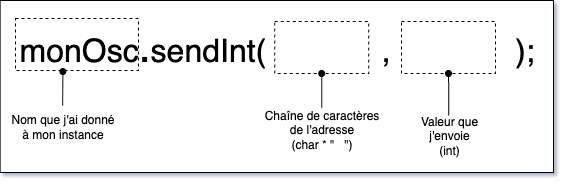

# L'envoi d'OSC avec MicroOsc

## Préalable(s)

- [Initialisation de MicroOsc](../initialisation/)

## Envoyer un entier par `MicroOsc` vers l'ordinateur

Utiliser `void sendInt(const char *address, int32_t i)` pour envoyer un entier. 



Par exemple, pour envoyer la valeur de `maVariable` à l'adresse OSC `/adresseOSC` :
```cpp
int maVariable = 10;
monOsc.sendInt( "/adresseOSC" , maVariable);
```

Un autre exemple pour envoyer la valeur de `maLectureAnalogique` à l'adresse OSC `/capteur` :
```cpp
int maLectureAnalogique = analogRead(BROCHE_CAPTEUR);
monOsc.sendInt( "/capteur" , maLectureAnalogique);
```

## Limiter la fréquence d’envoi

C’est une **très** bonne idée de limiter la fréquence d’envoi des messages. Un microcontrôleur peut envoyer des messages plus rapidement qu’ils ne peuvent être transmis et traités par le destinataire.

Pour chaque valeur de **capteur** envoyée via OSC, il est recommandé d’utiliser :
- Un **chronomètre** pour mesurer le temps entre chaque envoi de message, à l’aide de la bibliothèque [SofaPirate/Chrono](https://github.com/SofaPirate/Chrono).
- Une **variable globale** pour déterminer si la valeur mesurée a changé.

### Exemple : limiter la fréquence d’envoi d’un message analogique

#### Dans l’espace global

```cpp
#include <Chrono.h> // Ajouter la bibliothèque Chrono si ce n’est pas déjà fait

// Variables pour un capteur analogique --------------------------|
Chrono maLectureAnalogiqueChrono; // Chronomètre pour maLectureAnalogique
int maLectureAnalogique;          // Variable globale pour stocker la lecture
// ---------------------------------------------------------------|
```

#### Dans la boucle `loop()`

```cpp
// Mise à jour du capteur et envoi des données par OSC si nécessaire -------|
if (maLectureAnalogiqueChrono.hasPassed(5)) // si le chronomètre a dépassé 5 millisecondes
{
  int nouvelleLecture = analogRead(BROCHE_CAPTEUR); // lire la valeur du capteur

  // Envoyer une mise à jour si la valeur a changé 
  // ou si le chronomètre a dépassé 500 millisecondes
  if (maLectureAnalogique != nouvelleLecture || maLectureAnalogiqueChrono.hasPassed(500))
  {
    maLectureAnalogique = nouvelleLecture;      // mettre à jour la valeur stockée
    monOsc.sendInt("/capteur", maLectureAnalogique); // envoyer le message OSC
    maLectureAnalogiqueChrono.restart();        // réinitialiser le chronomètre
  }
}
// ------------------------------------------------------------------------|
```