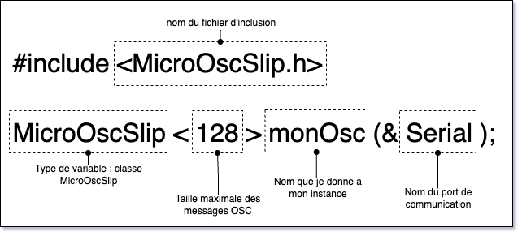

# Initialisation de MicroOsc

## Installation

### Arduino IDE

Télécharger la bibliothèque `MicroOsc` dans le gestionnaire de bibliothèques d'Arduino.

### PlatformIO

Ajouter la ligne suivante à `lib_deps` dans `platformio.ini` :
```
    https://github.com/thomasfredericks/MicroOsc.git
```

## OSC SLIP ou UDP

`MicroOsc` prend actuellement en charge deux protocoles de transport : Serial (avec SLIP) et UDP (Ethernet ou WiFi). Les deux versions utilisent un API identique, sauf pour leur initialisation.


## OSC *SLIP* : Initialisation


> [!NOTE]
> Suivre seulement ces instructions pour la version SLIP de l'OSC!

### Espace global

```cpp
#include <MicroOscSlip.h>
// Le nombre 128 entre les < > ci-dessous est le nombre maximal d'octets réservés pour les messages entrants.
// Les messages sortants sont écrits directement sur la sortie et ne nécessitent pas de réservation d'octets supplémentaires.
MicroOscSlip<128> monOsc(&Serial);
```



### Dans `setup()`

Dans `setup()`, n'oubliez pas de démarrer la communication série :
```cpp
  Serial.begin(115200);
```

> [!IMPORTANT] 
> Il ne faut plus utiliser les envois ASCII `Serial.print()` ou `Serial.println()` quand on utilise **OSC SLIP** parce que les messages **ASCII** vont corrompre le flux de données **OSC SLIP** 

> [!NOTE]
> L'initialisation de l'OSC SLIP est terminée.

## OSC *UDP* : Initialisation

> [!NOTE]
> Suivre seulement ces instructions pour la version UDP de l'OSC!


Initialisez d'abord l'Ethernet ou le WiFi selon votre matériel:
- Atom POE : [Initialisation de l'Ethernet pour un Atom POE](/m5stack/atom/poe/)

Initialisez ensuite l'UDP :
- Atom POE : [Initialisation de l'UDP](/arduino/udp/)

Initialisez les détails du réseau :
```cpp
// L'IP de destination doit avoir les mêmes trois premiers nombres que l'IP du microcontrolleur
IPAddress myDestinationIp(192, 168, 1, 210); 
unsigned int myDestinationPort = 7777;
```

Initialisez et incluez MicroOsc :
```cpp
#include <MicroOscUdp.h>
// Le nombre 1024 entre les < > ci-dessous est le nombre maximal d'octets réservés pour les messages entrants.
// Les messages sortants sont écrits directement sur la sortie et ne nécessitent pas de réservation d'octets supplémentaires.
MicroOscUdp<1024> myOsc(&myUdp, myDestinationIp, myDestinationPort);
```


La destination peut optionnellement être modifiée en cours d'exécution :
```cpp
myOsc.setDestination(IPAddress destinationIp , unsigned int destinationPort);
```
> [!NOTE]
> L'initialisation de l'OSC UDP est terminée.