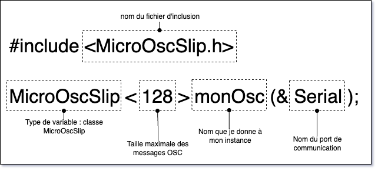

# MicroOsc *SLIP* : Initialisation

## Installation

### Arduino IDE

Télécharger la bibliothèque `MicroOsc` dans le gestionnaire de bibliothèques d'Arduino.

### PlatformIO

Ajouter la ligne suivante à `lib_deps` dans `platformio.ini` :
```ini
lib_deps =
    https://github.com/thomasfredericks/MicroOsc.git
```

## Intégration 

### Dans l'espace global

```cpp
#include <MicroOscSlip.h>
MicroOscSlip<128> monOsc(&Serial); // <#> : nombre d'octets pour la réception de messages
```



### Dans `setup()`

Dans `setup()`, n'oubliez pas de démarrer la communication série :
```cpp
  Serial.begin(115200);
```

> [!IMPORTANT] 
> Il ne faut plus utiliser les envois ASCII `Serial.print()` ou `Serial.println()` quand on utilise **OSC SLIP** parce que les messages **ASCII** vont corrompre le flux de données **OSC SLIP** 

