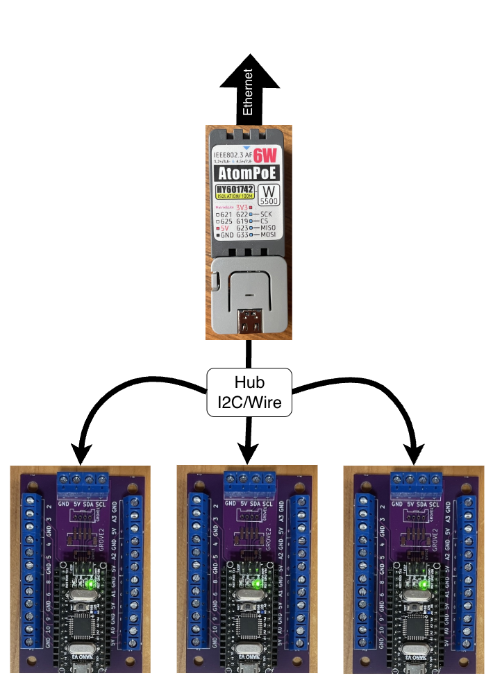
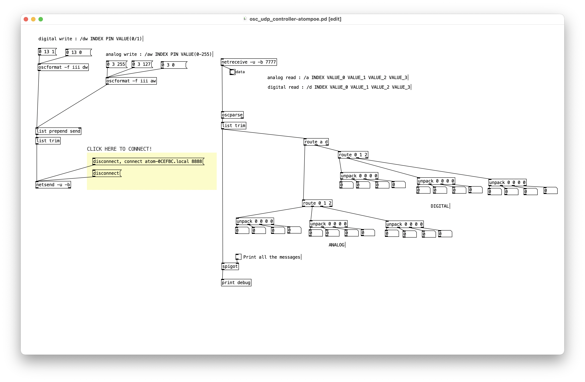

# MicroRemoteWire

`MicroRemoteWire` est une micro-bibliothèque Arduino qui permet à un microcontrôleur Arduino d’en contrôler un autre via I2C/Wire.



Dans l'exemple illustré ci-haut, un M5Stack Atom POE **alimente** et **contrôle** plusieurs plaquettes Arduino Nano :
- Le M5Stack Atom POE est le contrôleur, ce qui correspond au `MicroRemoteWireController` dans `MicroRemoteWire`.
- Les plaquettes Arduino Nano sont des `MicroRemoteWirePeripheral` dans `MicroRemoteWire`. 

Chaque `MicroRemoteWirePeripheral` doit se voir attribuer une adresse I2C/Wire unique.  
Le `MicroRemoteWireController` peut ensuite communiquer avec chaque `MicroRemoteWirePeripheral` en utilisant son adresse.

- Code source de la bibliothèque : [git de MicroRemoteWire](https://github.com/thomasfredericks/MicroRemoteWire)
 

## Principe de fonctionnement

`MicroRemoteWire` repose sur le bus I2C (appelé aussi Wire dans l’environnement Arduino).

- Le **contrôleur** envoie des commandes via I2C.
- Le **périphérique** reçoit ces commandes et les exécute (configuration de broche, écriture, lecture, etc.). Le périphérique attend simplement les commandes envoyées par le contrôleur.

Points importants :

- Toutes les cartes doivent partager la masse (GND).
- Les lignes SDA et SCL doivent être correctement connectées.
- Chaque périphérique doit avoir une adresse I2C unique.


## Côté périphérique

Le périphérique doit :

- Inclure la bibliothèque `MicroRemoteWirePeripheral`.
- Initialiser le bus I2C avec son adresse.
- Déclarer les fonctions `onReceive` et `onRequest`.

Dans le dossier `examples/peripheral-nano` du [git de MicroRemoteWire](https://github.com/thomasfredericks/MicroRemoteWire), il y a un exemple pour une carte configurée en tant que périphérique. La seule ligne à modifier est le numéro de l'I2C. Rappel : chaque périphérique doit avoir une adresse I2C unique.

Pour modifier le numéro de l'I2C, modifier la valeur de `PERIPHERAL_I2C_ADDR` :
```cpp
constexpr uint8_t PERIPHERAL_I2C_ADDR = 0x42;
```

##  Côté contrôleur

Le contrôleur doit :

- Inclure la bibliothèque `MicroRemoteWireController`.
- Configurer la communication avec l'ordinateur.
- **Pour chaque périphérique** : Créer un objet en lui passant le bus `Wire` et l’adresse configurée dans le code du périphérique.

Dans le dossier `examples/controller-atompoe` du [git de MicroRemoteWire](https://github.com/thomasfredericks/MicroRemoteWire), il y a un exemple pour une carte configurée en tant que contrôleur. 

L'exemple est assez complexe puisqu'il initialise une connexion Ethernet avec MicroNet et une communication UDP OSC avec [MicroOsc](/microosc/).

Il y a quelques éléments du code à configurer.

Indiquer les périphériques en ajoutant à `remote[ ]` une entrée pour chaque périphérique sur le bus I2C en spécifiant son adresse (l'adresse choisie lors du téléversement sur le périphérique). Ici, il y a 3 périphériques avec les adresses `0x42`, `0x43` et `0x44` :
```cpp
MicroRemoteWireController remote[] = {
    {Wire, 0x42},
    {Wire, 0x43},
    {Wire, 0x44},
};
```

Ensuite, il faut indiquer le nom de l'ordinateur vers lequel l'Atom POE doit envoyer les messages OSC. Modifier la valeur de la variable `nameToResolve` pour que cela corresponde au nom mDNS de l'ordinateur :
```cpp
const char * nameToResolve = "CM585787"; // Ne pas utiliser le suffixe ".local" / Do not append ".local"
``` 

L'Atom POE a aussi un nom mDNS. Il est généré automatiquement par le code. Après le téléversement du code, **ouvrir le moniteur série** : le nom mDNS de l'ATOM POE et son IP devrait y apparaître.

Code qui génère le nom mDNS de l'ATOM POE, à partir du préfixe `"atom-"` suivi de 3 codes hexadécimaux du MAC de l'ESP32 :
```cpp
 // Créer le nom de l'appareil pour mDNS
  char myName[MICRO_NET_NAME_MAX_LENGTH] = "atom-"; // name prefix
  myMicroNet.appendMacToCString(myName, MICRO_NET_NAME_MAX_LENGTH, 3);

  // Configure Ethernet et démarre le réseau et mDNS
  myMicroNet.begin(myName);
```

### Côté Pure Data

Dans le dossier `examples/controller-atompoe` du [git de MicroRemoteWire](https://github.com/thomasfredericks/MicroRemoteWire), il y a un le patch `osc_udp_controller-atompoe.pd` pour Pure Data qui démontrer comment communiquer avec le contrôleur. Ne pas oublier de modifier le nom mDNS du Atom POE dans la section jaune du patcher.

