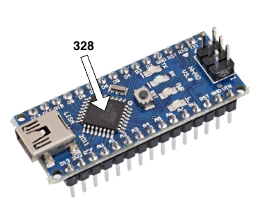
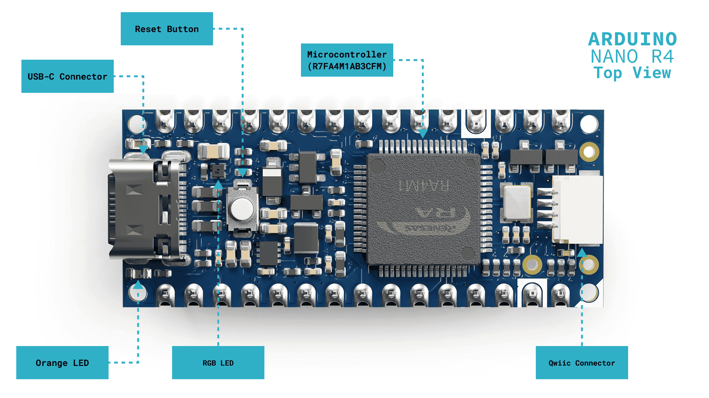
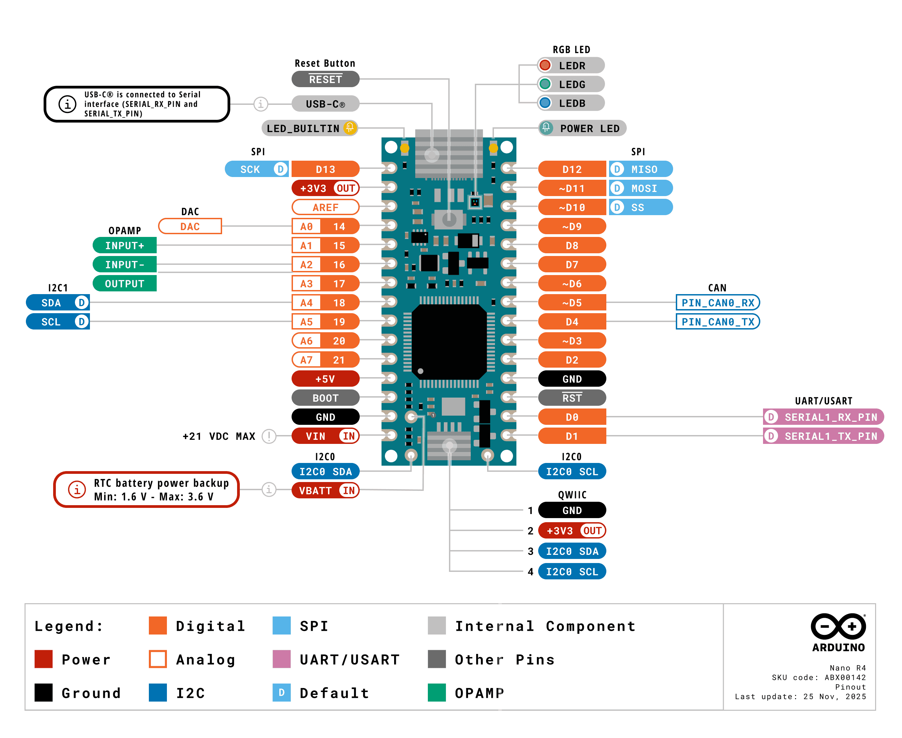

# Arduino Nano

L'Arduino Nano est disponible en trois modèles :
- `Arduino Nano ATmega168`.
- `Arduino Nano ATmega328` est très similaire au modèle précédent, mais porte l'inscription `328` sur la puce principale.
- `Arduino Nano R4` dont la puce principale a beaucoup plus de broches que les deux autres modèles.

Il est important d'identifier le modèle avant de poursuivre avec [l'initialisation](./initialisation/).

Tous les Arduino Nano fonctionnent sous 5 volts, ce qui signifie :
- Toutes les broches numériques utilisent des niveaux logiques 5 volts (HAUT = 5 V, BAS = 0 V)
- Les entrées analogiques peuvent accepter en toute sécurité une tension de 0 à 5 volts
- Les broches de communication (I²C, SPI, UART) fonctionnent avec des niveaux logiques 5 volts

## Arduino Nano ATmega168 et ATmega328

## Arduino Nano R4

Informations complémentaires sur ce modèle : [Nano R4 User Manual | Arduino Documentation](https://docs.arduino.cc/tutorials/nano-r4/user-manual/)
