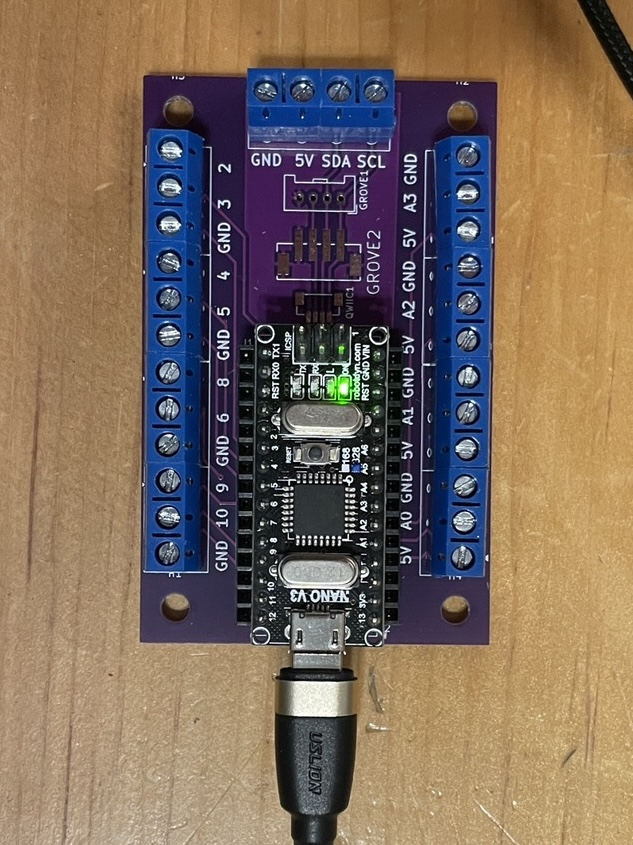
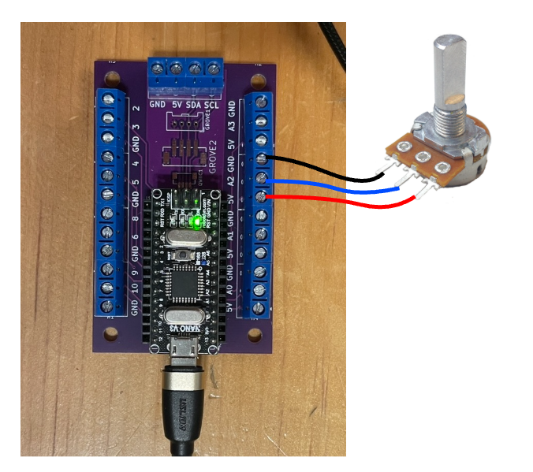

# Nano : Arduino Terminals

<!-- toc -->

[Arduino Terminals](https://codeberg.org/tim-montmorency/arduino_terminals) est un support pour cartes Arduino Nano doté de borniers à vis larges. Il permet un branchement simplifié du bus I2C, de 4 entrées analogiques et de 8 entrées/sorties numériques.



## Broches d'entrée analogique

Les broches analogiques disponibles sont :

- `A0`  
- `A1`  
- `A2`  
- `A3`  

Pour effectuer une lecture sur l’une de ces broches, il faut utiliser `analogRead()` en spécifiant la broche souhaitée, par exemple `A1` :

```cpp
int valeur = analogRead(A1);
```

## Broches d'entrée numérique

Les broches d’entrée numérique sont :

- `2`  
- `4`  
- `8`  
- `9`  

Pour lire l’état d’une de ces broches, il faut utiliser `digitalRead()` en spécifiant la broche, par exemple `8` :

```cpp
int valeur = digitalRead(8);
```

## Broches de sortie (analogique et numérique)

Les broches suivantes peuvent être utilisées comme sorties numériques et supportent également la modulation analogique :

- `3`  
- `5`  
- `6`  
- `10`  

Pour envoyer 5 V (niveau logique HIGH) sur une broche, il faut utiliser `digitalWrite()` en précisant la broche, par exemple `3`, ainsi que le mot-clé `HIGH` :

```cpp
digitalWrite(3, HIGH);
```

Pour envoyer 0 V (niveau logique LOW) :

```cpp
digitalWrite(3, LOW);
```

Pour générer une tension moyenne proportionnelle entre 0 et 5 V (analogique), il faut utiliser `analogWrite()` en précisant la broche et une valeur de type `uint8_t` comprise entre 0 et 255 (inclusivement) :

```cpp
analogWrite(3, intensity);
```


## Exemple : Bouton d’arcade

### Préparation du bouton

Un bouton d’arcade avec DEL intégrée nécessite la soudure de deux paires de fils (quatre fils au total) :

- Première paire : positif (+) et négatif (–) de la DEL. Il est essentiel de distinguer le positif du négatif. Le négatif sera raccordé au GND.
- Deuxième paire : les deux broches de l’interrupteur. Ces broches sont interchangeables. L’une d’elles sera raccordée au GND.

Les points de soudure et les étiquettes peuvent varier selon le modèle. L’exemple présenté utilise le modèle [bouton Arcade Button with LED – 30mm Translucent Red d'Adafruit ](https://www.adafruit.com/product/3489).

> [!NOTE]
> L’important est d’identifier correctement les broches et d’y souder idéalement quatre fils de couleurs différentes.

> [!NOTE]
> Une broche de l’interrupteur peut être soudée au négatif de la DEL, ce qui permet d’utiliser trois fils au lieu de quatre.

### Branchement

Le bouton doit être raccordé à l’Arduino selon la logique suivante :

| Bouton d’arcade | Arduino |
|-----------------|----------|
| Positif (+)     | Sortie (analogique ou numérique) |
| Négatif (–)     | GND |
| Une broche de l’interrupteur | Entrée numérique |
| Autre broche de l’interrupteur | GND |

Les deux connexions GND peuvent être communes.

Exemple de branchement sur Arduino Terminals :

| Bouton d’arcade | Arduino Terminals |
|-----------------|------------------|
| Positif (+)     | 3 (sortie analogique) |
| Négatif (–)     | GND |
| Une broche de l’interrupteur | 2 (entrée numérique) |
| Autre broche de l’interrupteur | GND (via le négatif de la DEL) |


### Utilisation 

Lecture de l’interrupteur :

```cpp
int valeur = digitalRead(2);
```

Allumage de la DEL :

```cpp
digitalWrite(3, HIGH);
```

Extinction de la DEL :

```cpp
digitalWrite(3, LOW);
```

Allumage de la DEL à environ 25 % de sa puissance :

```cpp
analogWrite(3, 63);
```

## Exemple : Potentiomètre

Un potentiomètre standard possède trois broches :

- Une broche reliée au **5V (ou 3.3V)**  
- Une broche reliée au **GND**  
- Une broche centrale appelée **curseur (signal)**  

Le curseur fournit une tension variable comprise entre 0 V et 5 V (ou 3.3 V selon la carte), en fonction de la position du potentiomètre.

Les deux broches extérieures peuvent être inversées, ce qui inversera simplement le sens de variation.  
La broche centrale doit être reliée à une entrée analogique.

### Branchement

Le branchement se fait selon la logique suivante :

| Potentiomètre | Microcontrôleur |
|---------------|-----------------|
| Broche extérieure | 5V (ou 3.3V) |
| Broche centrale (curseur) | Entrée analogique |
| Autre broche extérieure | GND |

Exemple de branchement sur Arduino Terminals :

| Potentiomètre | Arduino Terminals |
|---------------|------------------|
| Broche extérieure | 5V |
| Broche centrale (curseur) | A2 |
| Autre broche extérieure | GND |



### Utilisation

Lecture de la valeur :

```cpp
int valeur = analogRead(A2);
```
