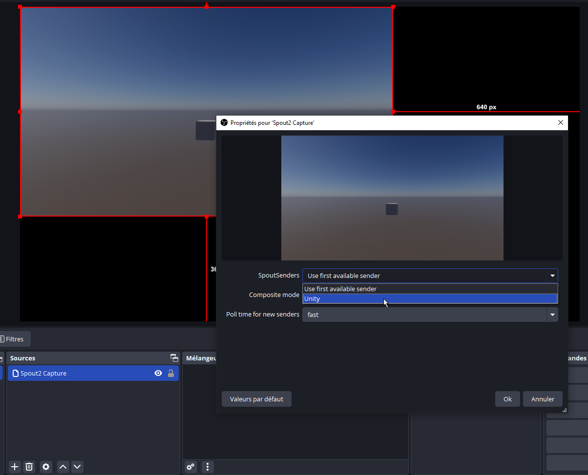
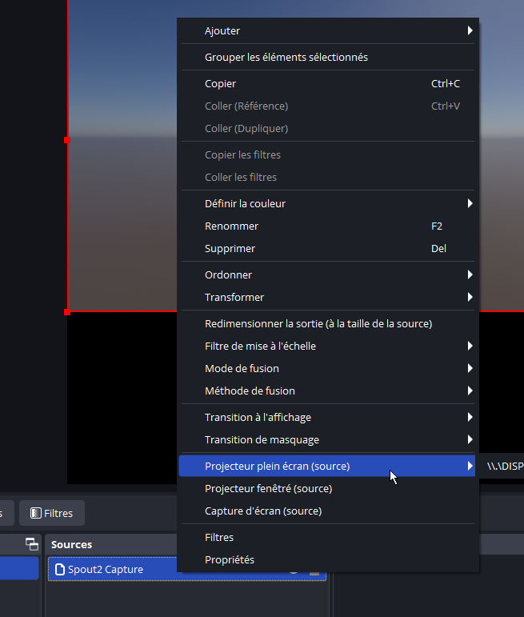

# Spout dans OBS

## Télécharger et installer Spout pour OBS

* Télécharger et lancer l'installateur d'[obs-spout2-plugin](https://github.com/Off-World-Live/obs-spout2-plugin/releases)

## Ajouter une source Spout

## Optionnellement, projeter la source Spout en plein écran

