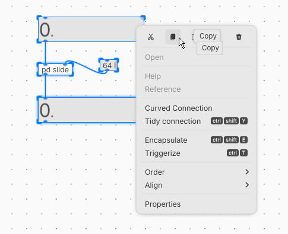
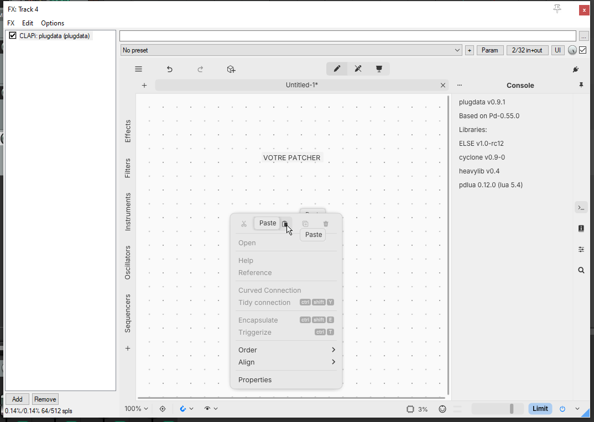

# Copier-coller avec PD

## Copier-coller lorsque plugdata est un plugin

### Ouvrir dans le logiciel plugdata, sélectionner les boîtes et copier avec le clic droit

### Ouvrir votre patch qui roule dans le pluging plugdata et coller avec le clic droit

