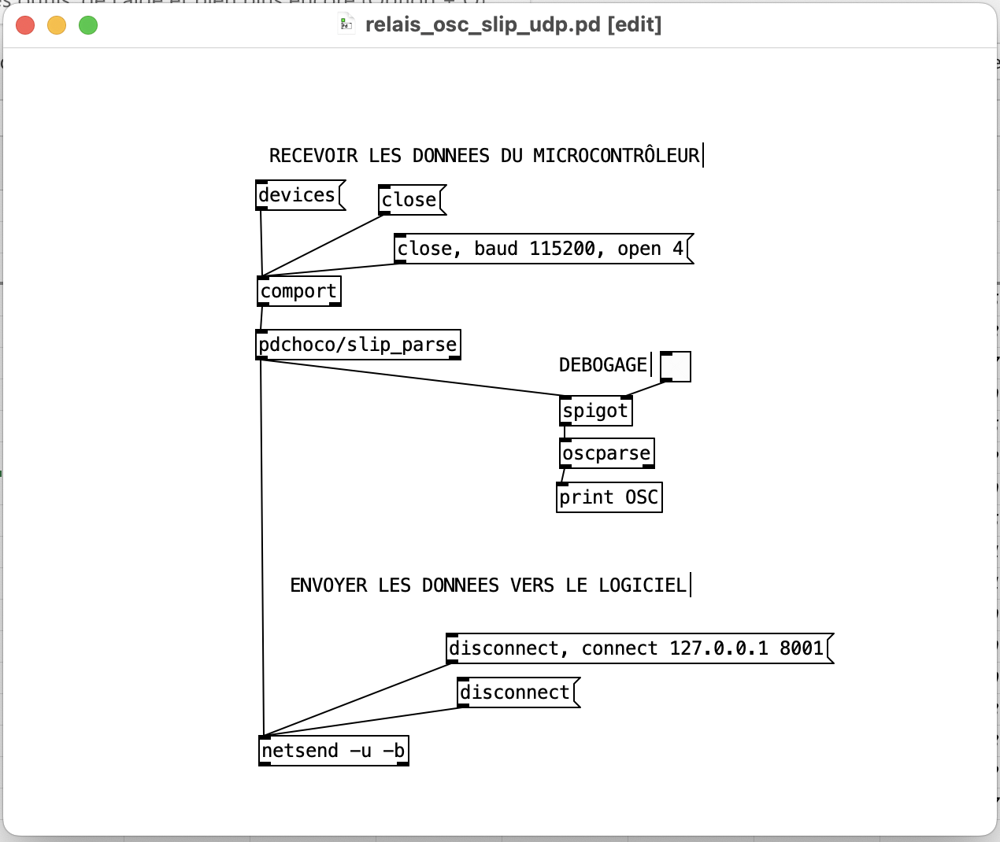

# Pd : Relais OSC SLIP ⇄ UDP

## Prérequis

- Installation de [comport](../../serial/)
- Installation de [pdchoco](../../pdchoco/)

## Patcher Pure Data pour le relais des messages OSC SLIP -> UDP 

