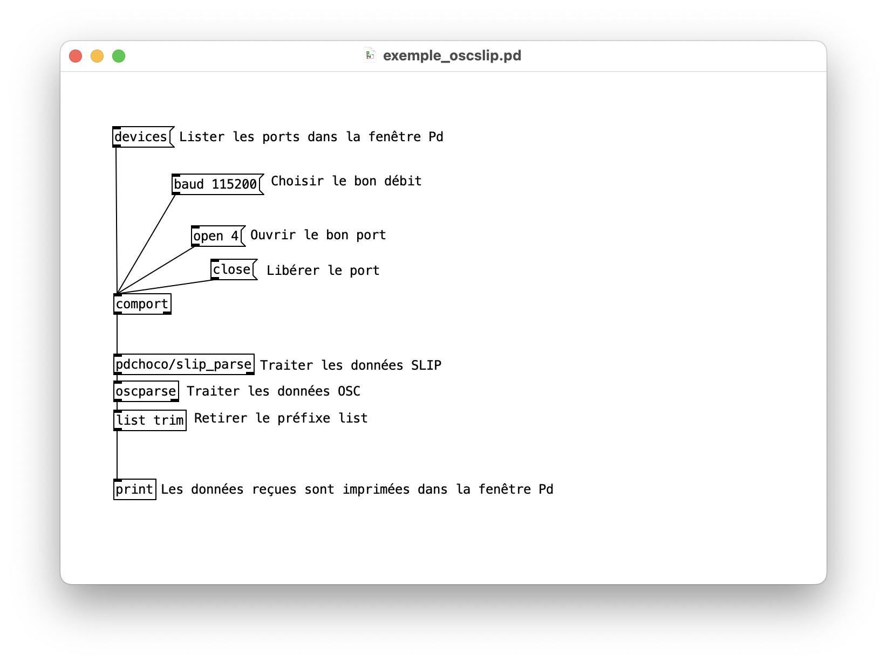
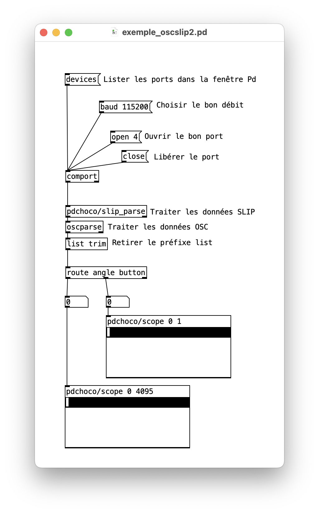

#  OSC SLIP dans Pd

## Installation des objets additionnels pour l'OSC SLIP dans Pure Data

### Objet `comport`

Suivre les instructions pour l'installation de `comport` : [communication sérielle dans Pd](../../serial/)

### Objet `slip_parse` de `pdchoco`

Suivre les instructions pour l'installation de `pdchoco` : [thomasofredericks/pdchoco: A collection of abstractions for Pure Data (version 0.56 and up) that requires no externals (i.e. is good with vanilla). - Codeberg.org](https://codeberg.org/thomasofredericks/pdchoco)

## Exemple pour la réception de messages OSC SLIP 

### Patcher de base

Télécharger le patcher ici : [exemple_oscslip.pd](./exemple_oscslip.pd)

## Patcher avec du *routing* et de la visualisation

Télécharger le patcher ici : [exemple_oscslip2.pd](./exemple_oscslip2.pd)

