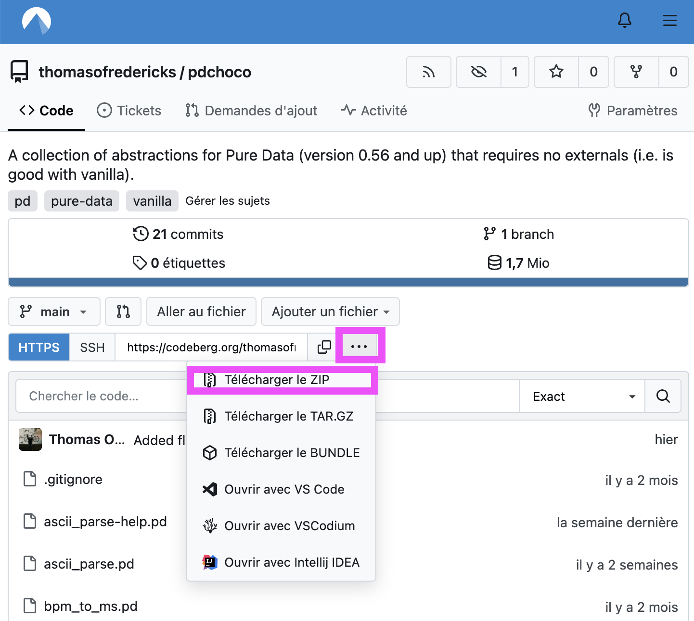
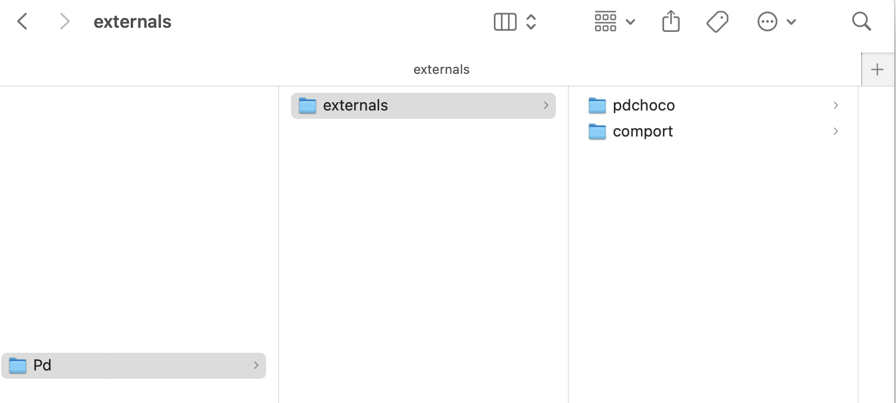

# pdchoco

## Installation

### Télécharger

Télécharger à partir de [thomasofredericks/pdchoco sur Codeberg.org](https://codeberg.org/thomasofredericks/pdchoco)

### Déplacer

Déplacez le dossier **pdchoco** ( pas *pdchoco-main* ) dans **Documents > Pd > externals**

## Abstractions (version V0.1)

- `ascii_parse` : Convertit les octets ASCII entrants en messages Pd. Il accumule les octets reçus (jusqu'à 1024) et émet le résultat une fois qu'un octet de fin de message est reçu. L'entrée peut être des octets individuels ou des listes d'octets.
- `edge_trigger` : Émet un bang lorsqu’un nombre devient ou cesse d’être égal à 0.
- `either` : Le bang d’entrée sort soit par la sortie gauche soit par la droite, selon la valeur de l’entrée droite (0 : gauche, 1 : droite).
- `flip_flop` : Émet la valeur du bascule interne. Cette valeur alterne entre 0 et 1 à chaque bang.
- `f~` : Convertit un message float en signal, comme `sig~`, mais avec un fondu (pour éviter les clics).
- `list_accum` : Accumule dans une liste tous les éléments reçus jusqu’à un bang, qui déclenche l’émission de la liste et sa remise à zéro.
- `list_accum_lastx` : Accumule dans une liste les X derniers éléments reçus.
- `list_iterator` : Itère les éléments d’une liste.
- `list_iterator_delayed` : Itère les éléments d’une liste avec un délai entre chaque.
- `map` : Remappe et limite une plage d’entrée vers une plage de sortie.
- `matches_start_of` : Vérifie si tous les caractères de l’entrée correspondent au début d’une référence. La comparaison utilise `expr` et `strncmp`. Requiert PD version >= 0.55-2.
- `message_looper` : Enregistre tout type de message dans le temps et les rejoue en boucle.
- `modulo` : Modulo mathématique au lieu du modulo de programmation (%).
- `once` : Laisse passer un seul bang. Permet un nouveau bang à chaque fois qu’un bang est reçu à l’entrée droite.
- `once_ready` : Laisse passer un seul bang si un bang a été reçu auparavant à l’entrée droite.
- `param`
- `param_collect`
- `param_forward`
- `param_get`
- `param_storage`
- `scope` : Affiche les valeurs d’entrée dans une "oscilloscope" graphique.
- `skipped_integers` : Émet les entiers reçus et les entiers intermédiaires si certains ont été sautés entre deux entrées successives.
- `slip_pack` : Emballe une liste d’octets dans un message SLIP.
