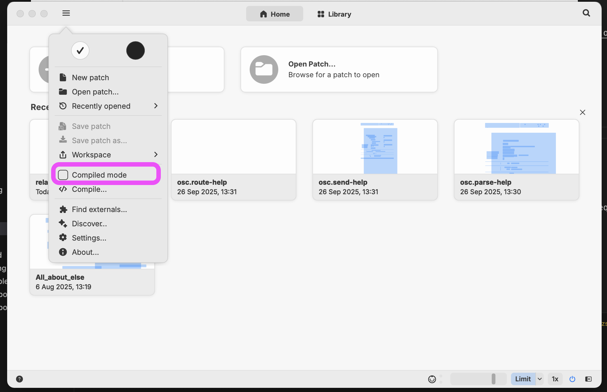
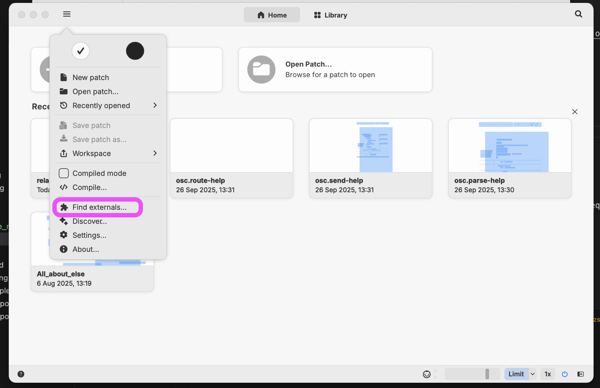
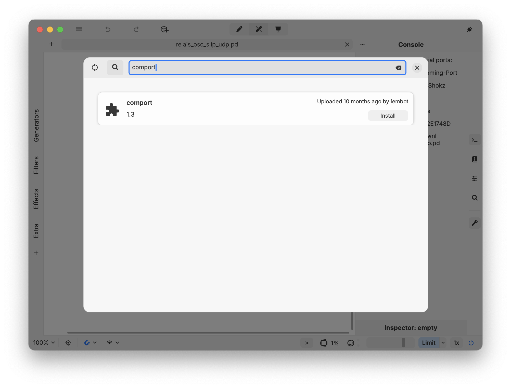

# Introduction à Plug Data

## Installation

- Le téléchargement du logiciel Plug Data se trouve ici : [plugdata - Download](https://plugdata.org/download.html)

> [!WARNING]
> Installer la version `CLAP` et `Standalone`

## Désactivation du mode compilation

## Installation d'externes et de bibliothèques

Il est préférable d'installer les externes et bibliothèques de Plug Data séparément de Pure Data. 

Pour l'installation manuelle (de [pdchoc](../../pdchoco/) par exemple) d'externes ou de bibliothèques il faut les déposer dans le dossier : `Documents > plugdata > Externals`.

Pour l'installation d'externes dans l'application, passer par le menu `Find externals` :

Par exemple, pour installer `comport` :

