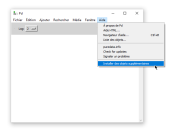
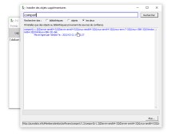
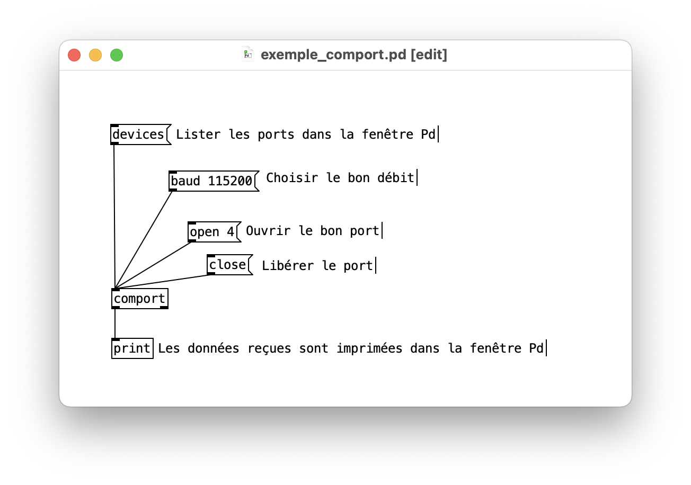

# Communication sérielle dans Pure Data

## Installation de `comport`

Pour recevoir et envoyer sur le port série, il est nécessaire d'ajouter l'object **comport** à Pure Data.

## Exemple d'utilisation 

Télécharger l'exemple ici : [exemple_comport.pd](./exemple_comport.pd)