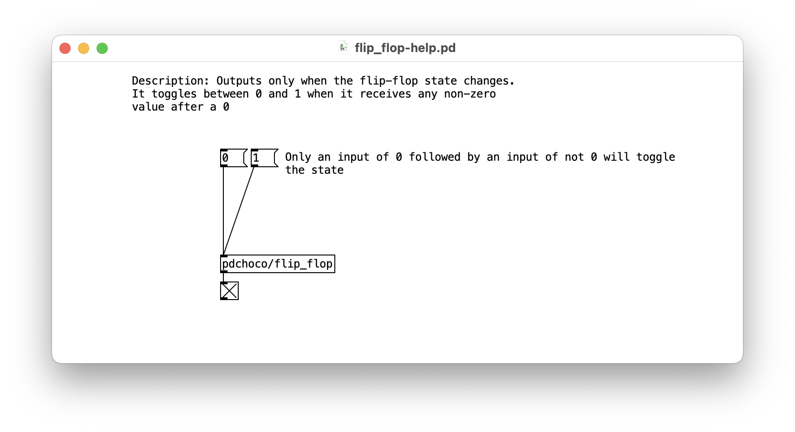

# Pd : Basculer (flip-flop/toggle) une valeur

- Installer [pdchoco](../../pdchoco/)
- `[pdchoco/flip-flop]` : Produit une sortie uniquement lorsque l’état du flip-flop change. Il bascule entre 0 et 1 lorsqu’il reçoit une valeur non nulle après un 0

