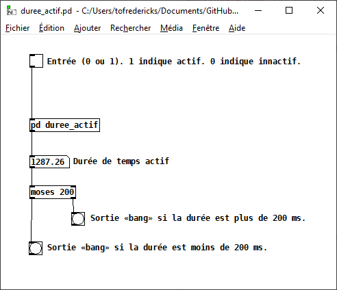

# Mesurer la durée

## Mesurer la durée d'activité avec *duree_actif.pd*

Télécharger ici : [duree_actif.pd](./duree_actif.pd)

**Dans le cas de plugdata en tant que plugin**, suivre ces [instructions sur copier-coller](/pd/copier-coller/README.md) pour transférer ce patch à votre propre patch.

