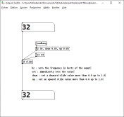

# Effectuer un glissement entre des valeurs avec PD

## Patch de glissement *slide.pd*

Ce patch de permet d'effectuer un glissement sur un flux de valeur. Il permet de rendre plus continu et de réduire les aspérités. Un facteur de glissement différent peut être configuré si le flux de valeur augmente ou s'il baisse.

Télécharger ici : [slide.pd](./slide.pd)

**Dans le cas de plugdata en tant que plugin**, suivre ces [instructions sur copier-coller](/pd/copier-coller/README.md) pour transférer ce patch à votre propre patch.

## Exemple du glissement

## Configuration du glissement

