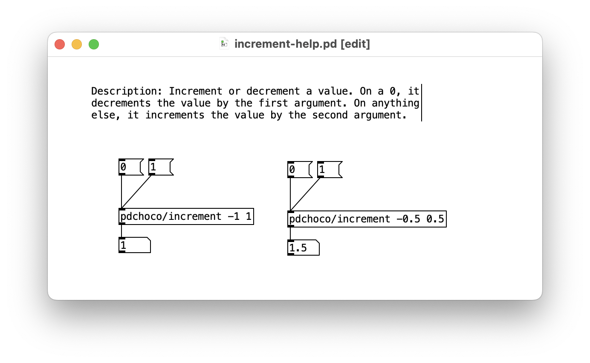

# Pd : Incrémenter (ou décrémenter) une valeur

- Installer [pdchoco](../../pdchoco/)
- `[pdchoco/increment]` : Incrémente ou décrémente une valeur. Avec une entrée de 0, la valeur est décrémentée du premier argument. Avec toute autre entrée, elle est incrémentée du second argument.

