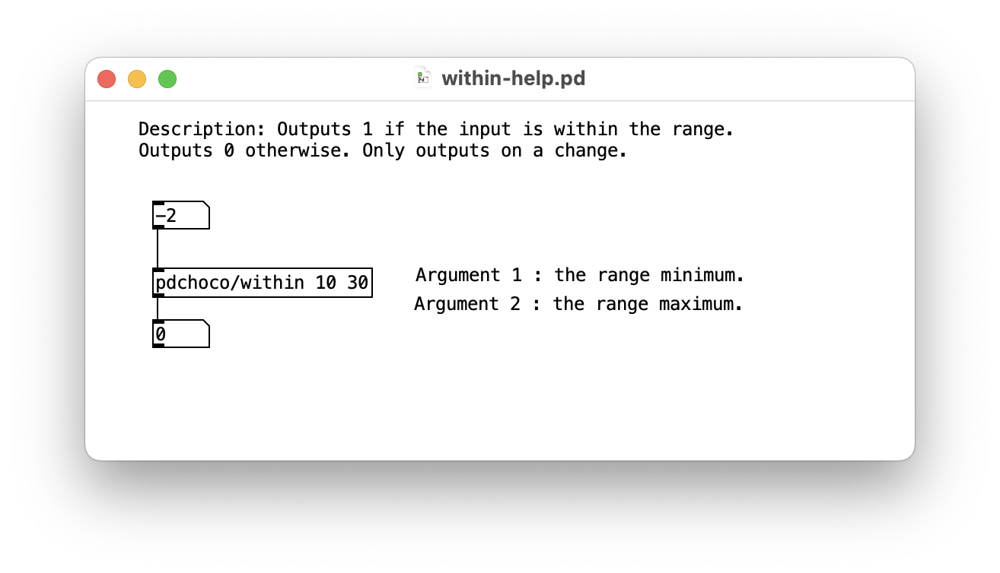

# Pd : Déterminer si une valeur est à l'intérieur d'une plage

- Installer [pdchoco](../../pdchoco/)
- `[pdchoco/within]` : Renvoie 1 si l’entrée est dans la plage, sinon 0. Ne produit une sortie qu’en cas de changement.

