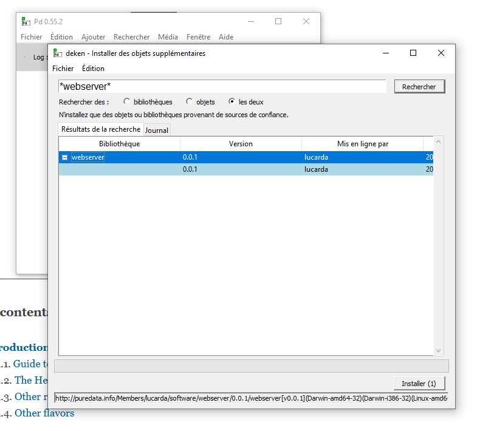
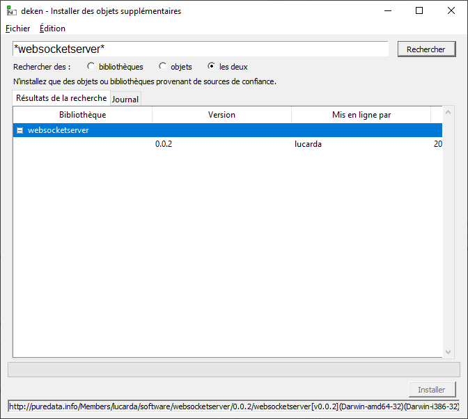
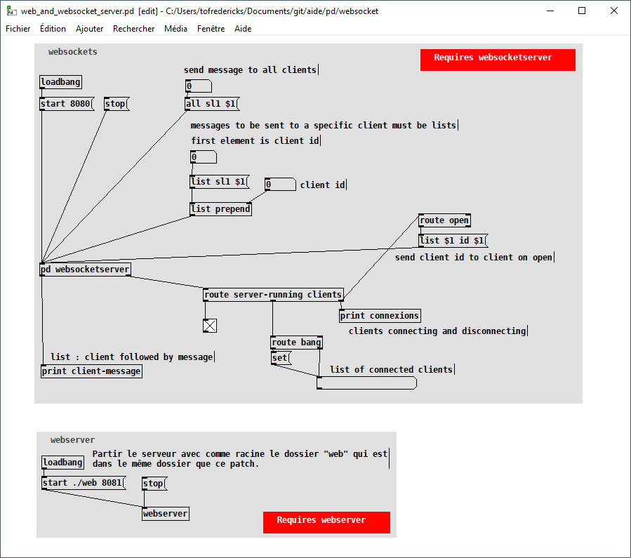

# WebSockets dans PD

## Installation

### Installer l'externe *webserver*

### Installer l'externe *websocketserver*

## Patcher

- Télécharger le patch ici : [web_and_websocket_server.zip](./web_and_websocket_server.zip).
- Après avoir ouvert le patcher, ouvrez la page *http://localhost:8081* dans votre navigateur.